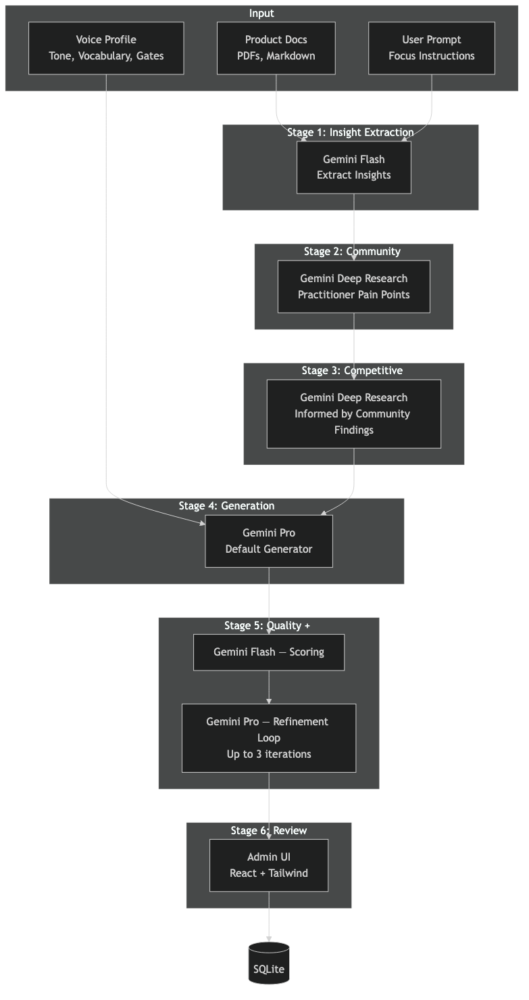
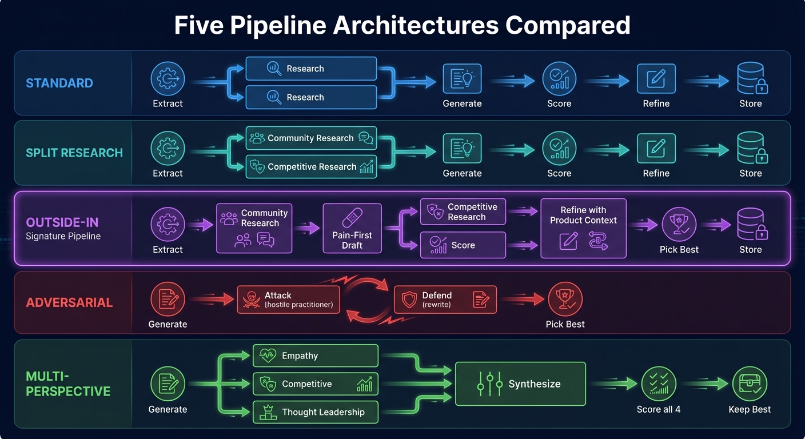
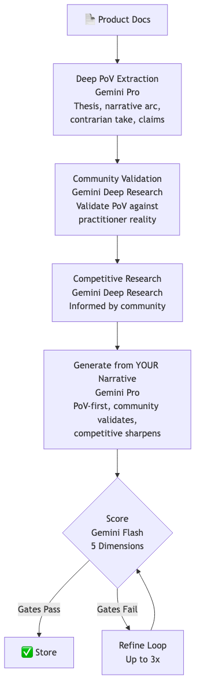
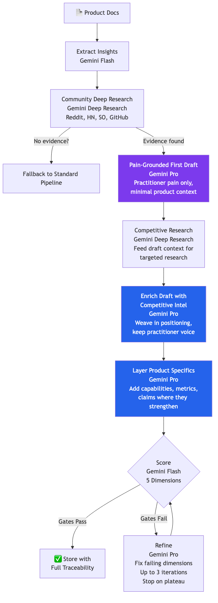
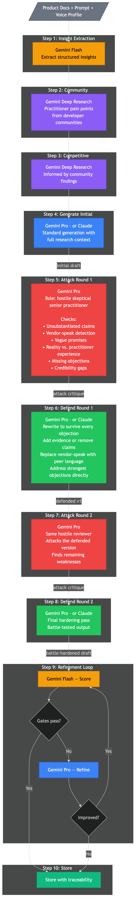
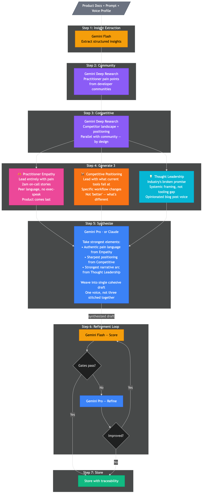
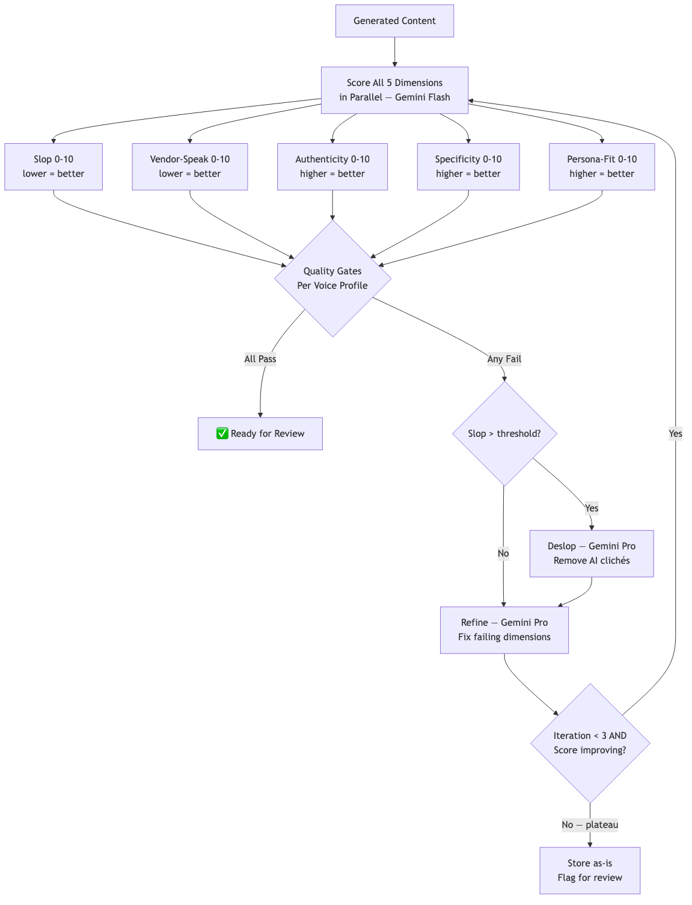
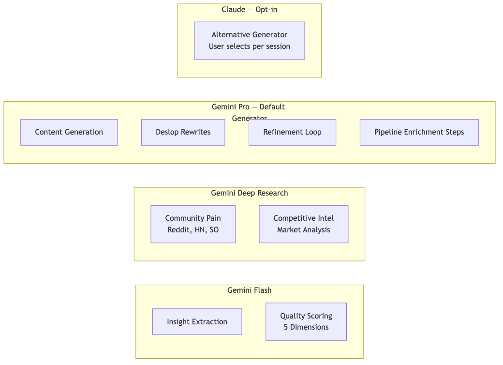
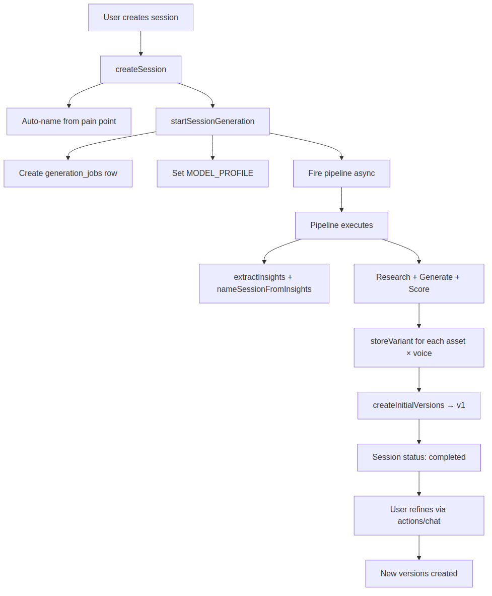
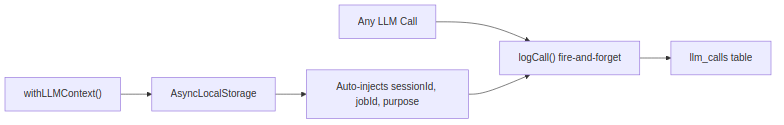

# PMM Messaging Engine

A full-stack messaging workbench that turns product documentation and practitioner pain into scored, traceable PMM assets.

The core idea is simple: do not start with vendor claims. Start with real practitioner frustration, gather evidence, generate messaging through explicit agentic loops, then score and refine the output until it either passes quality gates or clearly needs human review.



## What It Builds

The engine generates and evaluates common product marketing assets:

| Asset Type | Use Case |
| --- | --- |
| Messaging template | Full positioning and messaging foundation |
| Battlecard | Competitive positioning and objection handling |
| One-pager | Concise product or campaign summary |
| Talk track | Sales-ready conversation guide |
| Launch messaging | Product launch narrative and copy |
| Email copy | Campaign-ready email drafts |
| Narrative | Story-led messaging variants |
| Social hook | Short-form social angles |

Each output is stored with quality scores, source evidence, voice profile, prompt traceability, and version history.

## System Overview

The app is a Node.js + TypeScript service with a React admin/workspace UI, SQLite persistence, and a pipeline engine that coordinates multiple LLM calls.

| Layer | Responsibility |
| --- | --- |
| React workspace UI | Sessions, uploaded docs, asset selection, voice profiles, chat refinement |
| Hono API server | Public, admin, and workspace routes |
| Pipeline engine | Runs the selected generation loop |
| Evidence services | Community and competitive research |
| Quality services | Slop, vendor-speak, authenticity, specificity, and persona-fit scoring |
| AI client layer | Gemini, Deep Research, and optional Claude routing |
| SQLite database | Sessions, assets, variants, traceability, jobs, and LLM call logs |

## Agentic Pipeline Loops

The engine has five generation pipelines. They share primitives, but each pipeline uses a different reasoning loop.



| Pipeline | Slug | Best For | Core Loop |
| --- | --- | --- | --- |
| Standard | `standard` | General product-doc-driven messaging | Extract deep PoV -> research -> generate -> layer product proof -> score/refine |
| Outside-In | `outside-in` | Practitioner-authentic messaging | Community evidence -> pain-grounded draft -> competitive enrichment -> score/refine |
| Adversarial | `adversarial` | Battle-tested messaging | Draft -> hostile critique -> defense rewrite -> critique again -> defense again -> score/refine |
| Multi-Perspective | `multi-perspective` | Balanced strategic messaging | Draft -> empathy rewrite + competitive rewrite + thought-leadership rewrite -> synthesize -> score/refine |
| Straight-Through | `straight-through` | Auditing existing copy | Import existing content -> score -> store result |

## Shared Orchestrator

All pipelines compose the same orchestration primitives:

1. Load job inputs: product docs, voice profiles, asset types, pipeline choice.
2. Extract product insights and name the workspace session.
3. Build evidence bundles from community and competitive research.
4. Generate content for each asset type and voice profile.
5. Score the content across five dimensions.
6. Run the refinement loop when the output can be improved.
7. Store the final variant with traceability records.
8. Log every LLM call for auditability.

```text
load inputs
  -> extract insights
  -> gather evidence
  -> generate asset
  -> score
  -> refine if useful
  -> store variant
  -> log traceability
```

## Evidence Loop

The evidence layer is deliberately opinionated: messaging should be grounded in real practitioner language whenever possible.

Evidence sources include Reddit, Hacker News, Stack Overflow, GitHub Issues, developer blogs, product documentation, and competitive research.

| Evidence Level | Criteria |
| --- | --- |
| `strong` | At least 3 source URLs from at least 2 host types |
| `partial` | At least 1 source URL or useful grounded-search text |
| `product-only` | No external practitioner evidence found |

The Outside-In pipeline treats `product-only` as a failure, not an invitation to make things up.

## Standard Pipeline

The Standard pipeline is the default "good PMM citizen" flow: extract a deep product point of view, research the market, draft the asset, layer in product proof, then run quality gates.



**Loop:**

1. Extract deep product PoV from uploaded docs.
2. Generate banned words for the selected voice profile.
3. Run community deep research for practitioner language.
4. Run competitive research informed by the community findings.
5. Generate each requested asset.
6. Score the draft.
7. Layer in product documentation for proof.
8. Refine until quality improves or plateaus.
9. Store the variant and traceability.

## Outside-In Pipeline

Outside-In is the signature loop. It starts with the market, not the vendor.



**Loop:**

1. Extract concise product insights.
2. Generate voice-specific banned words.
3. Run community deep research.
4. Fail if real practitioner evidence cannot be found.
5. Generate a pain-grounded draft from practitioner context.
6. Run competitive research for positioning.
7. Enrich the draft without diluting the practitioner voice.
8. Score and refine.
9. Store the final variant with evidence.

This pipeline intentionally removed product-doc layering because it made the output drift back into vendor voice. Brutal, but correct.

## Adversarial Pipeline

The Adversarial pipeline assumes the first draft is probably too soft.



**Loop:**

1. Extract insights.
2. Gather community and competitive research.
3. Generate an initial draft.
4. Attack round 1: a hostile senior practitioner critiques vendor-speak, vague promises, unsupported claims, and credibility gaps.
5. Defend round 1: rewrite the content to survive those objections.
6. Attack round 2: critique the defended version.
7. Defend round 2: rewrite again.
8. Run scoring and refinement.
9. Store the battle-tested variant.

The point is not to make the copy louder. It is to make weak claims die before a buyer sees them.

## Multi-Perspective Pipeline

The Multi-Perspective pipeline explores competing angles before selecting the strongest synthesis.



**Loop:**

1. Extract insights.
2. Gather community and competitive research.
3. Generate an initial draft.
4. Rewrite from three perspectives in parallel:
   - Empathy: leads with practitioner pain and lived context.
   - Competitive: sharpens differentiation and displacement logic.
   - Thought leadership: raises the narrative altitude.
5. Synthesize the strongest parts of all three.
6. Score the three rewrites plus the synthesis.
7. Keep the highest-scoring version.
8. Refine and store.

## Straight-Through Pipeline

Straight-Through does not generate new copy. It audits what already exists.


**Loop:**

1. Import existing messaging.
2. Extract product insights for context.
3. Score the content across all quality dimensions.
4. Store the scored version.
5. Surface whether it passes quality gates.

This is useful for turning old messaging into measurable messaging without asking the model to rewrite everything immediately.

## Quality Scoring Loop

Every generation pipeline eventually hits the same scoring system.



The scorers run in parallel:

| Scorer | Direction | What It Detects |
| --- | --- | --- |
| Slop | Lower is better | AI cliches, lazy phrasing, generic structure |
| Vendor-speak | Lower is better | Claims that sound like a press release |
| Authenticity | Higher is better | Whether a real practitioner might say or trust it |
| Specificity | Higher is better | Concrete details, mechanisms, examples |
| Persona-fit | Higher is better | Resonance with the selected audience profile |

The refinement loop is intentionally bounded:

1. Score the draft.
2. If too many scorers fail, skip refinement and mark for manual review.
3. If slop is high, run a deslop pass.
4. Build a targeted refinement prompt from failing scores.
5. Re-score the new version.
6. Stop when gates pass or improvement plateaus.

## Multi-Model Loop

The system uses different model classes for different jobs rather than treating all LLM calls as equal.



| Task | Model Class |
| --- | --- |
| Insight extraction | Fast model |
| Deep PoV extraction | Strong reasoning model |
| Community research | Deep Research |
| Competitive research | Deep Research |
| Content generation | Strong writing/reasoning model |
| Attack prompts | Strong reasoning model |
| Scoring | Fast model |
| Deslop/refinement | Strong writing model |

Model selection is routed through `getModelForTask(task)`, so production and economy/test profiles can swap models without rewriting pipeline logic.

## Workspace Session Loop

The workspace system turns one generation into an iterative asset-building session.



A session contains product context, selected asset types, voice profiles, generated versions, chat history, action jobs, and LLM call logs.

Typical loop:

1. User creates a session with product docs or pasted context.
2. Pipeline generates one or more assets.
3. Each generated asset becomes an active version.
4. User runs actions such as deslop, regenerate, voice change, competitive dive, community check, or multi-perspective rewrite.
5. Each action creates a new version rather than overwriting history.
6. Chat refinements can create accepted versions.
7. The session retains the full decision trail.

## LLM Call Logging

Every model call is logged for traceability and debugging.



Logged fields include:

| Field | Purpose |
| --- | --- |
| Session/job IDs | Connect calls to user-facing work |
| Model | Show which model produced or scored content |
| Purpose | Identify the pipeline step |
| System and user prompts | Reconstruct the exact instruction context |
| Response | Inspect output and failures |
| Token usage | Track cost and context size |
| Latency | Debug slow steps |
| Success/error | Audit failures |

This makes the system inspectable instead of mystical. Which, frankly, is where most "agentic" demos go to die.

## Development

### Prerequisites

- Node.js 22+
- npm
- SQLite-compatible local filesystem
- Gemini API key
- Anthropic API key if using Claude-backed calls

### Setup

```bash
npm install
cp .env.example .env
npm run db:push
npm run build
```

Start the backend:

```bash
npm run dev
```

Start the admin UI:

```bash
cd admin
npm install
npm run dev
```

### Tests

```bash
npm test
```

End-to-end tests call real model APIs and may take several minutes:

```bash
npm run test:e2e
```

## Key Files

| Path | Purpose |
| --- | --- |
| `src/services/pipeline/` | Pipeline engine and agentic loops |
| `src/services/pipeline/pipelines/` | Individual pipeline implementations |
| `src/services/quality/` | Scoring and quality gates |
| `src/services/ai/` | Model clients, routing, rate limits, logging |
| `src/services/workspace/` | Sessions, versions, chat, and actions |
| `src/db/schema.ts` | SQLite schema |
| `docs/` | Full diagrams and generated documentation |
| `PIPELINE.md` | Detailed pipeline reference |
| `ARCHITECTURE.md` | Architecture notes and design history |
| `DATABASE.md` | Schema reference |

## Design Principles

- Practitioner evidence beats vendor imagination.
- Outputs should be scored, not merely admired.
- Failed evidence lookup should be explicit.
- Agentic loops should be inspectable and bounded.
- Every generated asset should be traceable to prompts, evidence, model calls, scores, and versions.
