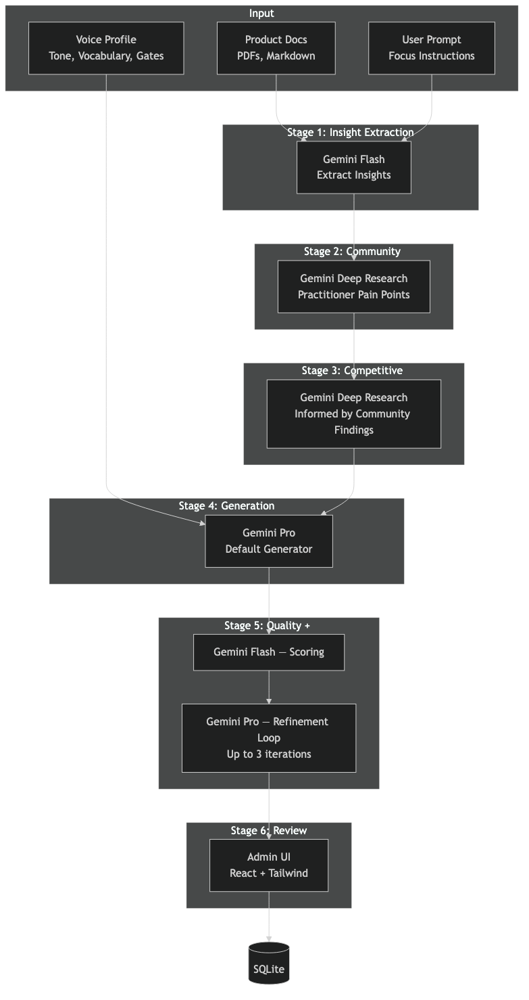
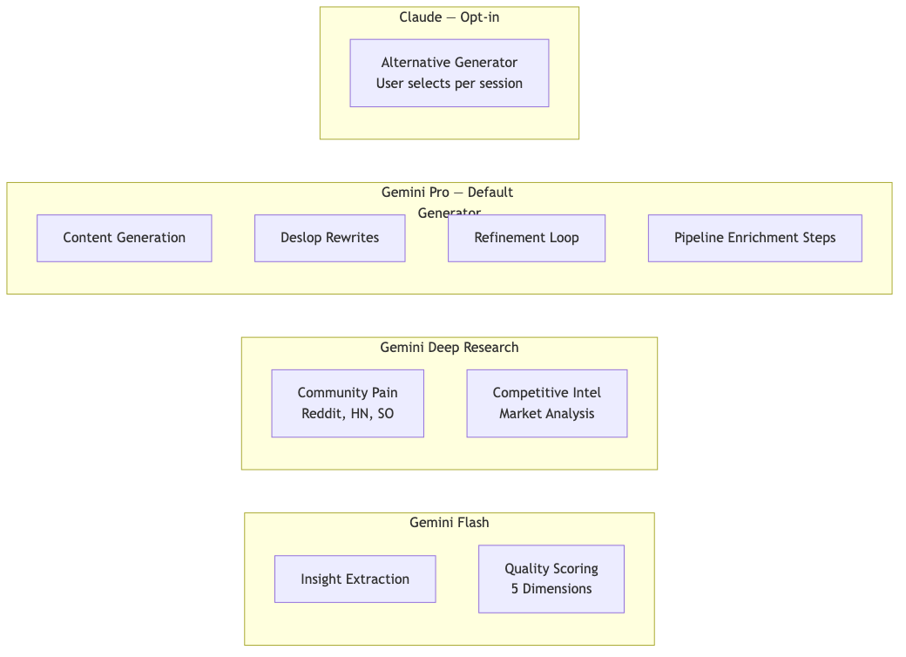
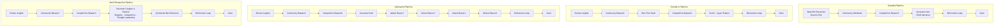
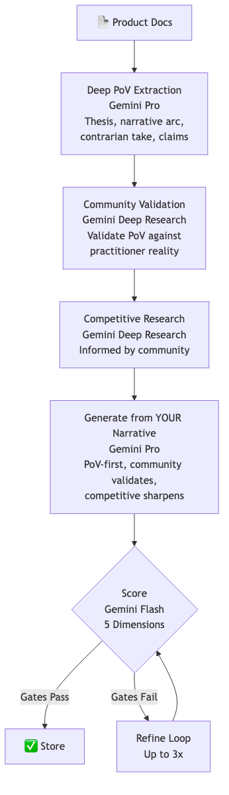
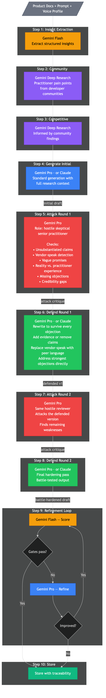
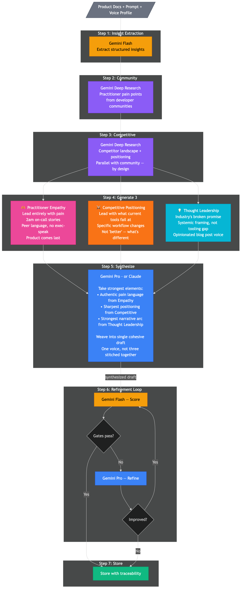
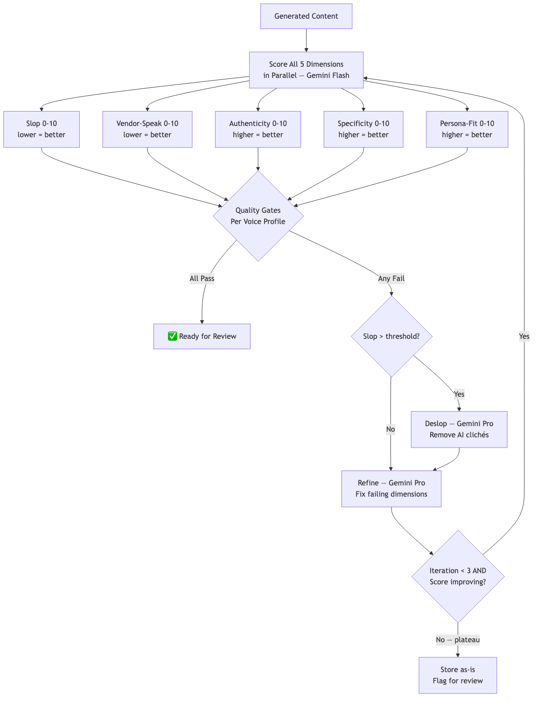

# PMM Messaging Engine — Technical Documentation

*Comprehensive Architecture, Pipeline, and Prompt Reference*

---

## 1. Executive Summary

The PMM Messaging Engine is a sophisticated content generation platform that converts practitioner pain points from community sources into scored, quality-tested messaging assets. It represents a paradigm shift from traditional "vendor-out" marketing content to an "outside-in" approach that starts with real practitioner pain discovered in developer communities.

### Core Innovation

Unlike conventional marketing tools that begin with product features and work outward, the Messaging Engine's signature **Outside-In Pipeline** starts by mining real developer communities (Reddit, Hacker News, Stack Overflow, GitHub Issues) for genuine practitioner frustrations, then builds messaging that leads with empathy before introducing product solutions.

### Key Capabilities

- **4 distinct generation pipelines** — Standard, Outside-In (signature), Adversarial, and Multi-Perspective
- **Sequential DAG architecture** — each pipeline step feeds the next, no "pick best" comparisons
- **Shared refinement loop** — all pipelines end with iterative score → deslop → refine (up to 3x)
- **Multi-model AI strategy** leveraging 4 specialized AI models
- **5-dimension quality scoring** with automated gates and plateau detection
- **8 asset types** from battlecards to narratives
- **Voice profile system** with persona-specific quality thresholds
- **Live pipeline step streaming** via `emitPipelineStep()` events
- **Full traceability** from source community evidence to final asset

### Tech Stack

| Layer | Technology |
|-------|-----------|
| Backend | Hono (REST API), TypeScript |
| Frontend | Vite + React + Tailwind CSS (10-page admin UI) |
| Database | SQLite + Drizzle ORM (14 tables, incl. `pipelineSteps` column) |
| AI Models | Gemini Flash, Gemini Pro (default generator), Gemini Deep Research, Claude (opt-in) |

---

## 2. System Architecture



### Architecture Overview

The system follows a 6-stage pipeline architecture:

```
Product Docs → Insight Extraction → Research → Generation → Quality → Output
```

#### Stage 1: Product Document Input
- Users upload product documentation (PDFs, text, markdown)
- Supports up to 200K characters of source material
- Documents are stored and versioned in SQLite

#### Stage 2: Insight Extraction (Gemini Flash)
- Parses raw product documentation into structured insights
- Extracts: capabilities, differentiators, personas, pain points, claims, technical details
- Output is a JSON schema used by all downstream stages

#### Stage 3: Research (Gemini Deep Research)
- **Community Deep Research**: Searches developer communities for real practitioner pain
- **Competitive Research**: Analyzes competitor landscape and positioning
- Community research runs first, then competitive research is informed by community findings

#### Stage 4: Content Generation (Gemini Pro default, Claude opt-in)
- Generates messaging assets using extracted insights + research
- Gemini Pro is the default generation model; Claude is available when explicitly selected
- Supports 8 asset types × multiple voice profiles
- 4 pipeline variants, all ending with the shared refinement loop

#### Stage 5: Quality Pipeline (Gemini Flash + Gemini Pro)
- 5-dimension parallel scoring
- Quality gates with per-voice thresholds
- Shared refinement loop: score → deslop if needed → refine → check plateau (up to 3x)
- Deslop processing to remove AI clichés

#### Stage 6: Asset Output & Storage
- Final assets stored with full traceability metadata
- Grounding validation strips fabricated quotes
- Workspace actions enable post-generation refinement

### Infrastructure

```
┌─────────────────────────────────────────────┐
│                Hetzner VPS                   │
│                                              │
│  ┌──────────┐  ┌──────────┐  ┌───────────┐ │
│  │  Hono    │  │  React   │  │  SQLite   │ │
│  │  API     │←→│  Admin   │  │  + Drizzle│ │
│  │  :3007   │  │  UI      │  │           │ │
│  └────┬─────┘  └──────────┘  └───────────┘ │
│       │                                      │
│  ┌────┴────────────────────────────────┐    │
│  │         AI Model Gateway            │    │
│  │  Gemini Flash │ Deep Research │      │    │
│  │  Gemini Pro   │ Claude        │      │    │
│  └─────────────────────────────────────┘    │
└─────────────────────────────────────────────┘
```

---

## 3. Multi-Model AI Strategy



The Messaging Engine uses a deliberate multi-model strategy where each AI model is selected for its specific strengths:

### Gemini Flash — Speed Operations
- **Role**: Fast evaluations and scoring
- **Used for**: Product insight extraction, quality scoring (all 5 dimensions in parallel), quick evaluations
- **Why**: Low latency, high throughput, cost-effective for structured extraction tasks

### Gemini Deep Research — Deep Intelligence
- **Role**: Citation-backed research
- **Used for**: Community Deep Research (Reddit, HN, SO, GitHub Issues, dev blogs), competitive landscape analysis
- **Why**: Ability to search and synthesize across multiple web sources with citations

### Gemini Pro — Default Generation & Quality Control
- **Role**: Primary content generation and content analysis/rewriting
- **Used for**: Default messaging generation across all pipelines, slop detection, deslop rewrites, refinement rewrites, adversarial attack prompts
- **Why**: Strong at nuanced, voice-consistent writing and analytical language evaluation

### Claude — Opt-In Content Generation
- **Role**: Alternative content creation (user-selectable per session)
- **Used for**: All generation tasks when explicitly selected instead of Gemini Pro
- **Why**: Available as an alternative when users prefer it. The `generateContent()` function defaults to Gemini Pro and only routes to Claude if the model name contains "claude"

*See pipeline diagrams above for model interaction flows.*

---

## 4. Pipeline Architecture

### Design Principles (Feb 2025 Refactor)

All 4 pipelines share these architectural principles:

1. **Sequential DAG pattern** — each step feeds the next. No `pickBestResult()` comparisons. The output of each step IS the input to the next step.
2. **Shared refinement loop** — every pipeline ends with `refinementLoop()`: score → deslop if slop exceeds threshold → refine targeting failing dimensions → check for plateau → repeat up to 3 iterations.
3. **Pipeline step events** — `emitPipelineStep()` writes progress to `generation_jobs.pipelineSteps` for live UI streaming. Steps include `extract-insights`, `research`, `generate`, `refine`, plus pipeline-specific steps like `pain-draft`, `attack-r1`, `defend-r1`, `synthesize`, etc.
4. **`generateAndScore()` is simple** — generates content and scores it. No inline refinement. Refinement is handled exclusively by `refinementLoop()`.

### Removed in This Refactor

- **Split Research Pipeline** — removed entirely (was identical to Standard; both already run community → competitive research sequentially)
- **`pickBestResult()` pattern** — removed from all pipelines. Each pipeline follows a sequential DAG.
- **`generateAndScoreVariant()`** — simplified to `generateAndScore()` with no inline refinement logic



### 4.1 Standard Pipeline (PoV-First)



The product-narrative-first pipeline. Instead of leading with pain (that's Outside-In), Standard leads with the product's **point of view** — its thesis, contrarian take, and narrative arc. Community research validates the PoV rather than driving it.

**Philosophy**: "Here is our story — validate it against practitioner reality."

**Sequential DAG:**
```
Deep PoV Extraction → Community Validation → Competitive Research → Generate from YOUR Narrative → Refinement Loop → Store
```

#### Standard vs Outside-In Comparison

| Aspect | Standard Pipeline | Outside-In Pipeline |
|--------|------------------|---------------------|
| **Philosophy** | "Here is our story — validate it" | "What is the community saying — build from that" |
| **Step 0** | Deep PoV Extraction (Gemini Pro) | Extract Insights (Gemini Flash) |
| **Extraction** | Thesis, contrarian take, narrative arc, strongest claims | Capabilities, differentiators, pain points |
| **Community Research** | Validation — confirms/challenges our PoV | Discovery — drives the narrative |
| **Generation Prompt** | PoV-first: leads with thesis and narrative arc | Pain-first: leads with practitioner frustration |
| **System Prompt** | "Lead with your point of view" | "Lead with the pain" |
| **Content Voice** | Opinionated, defensible argument | Empathetic, practitioner-resonant |
| **Best For** | Product launches, thought leadership, narratives | Battlecards, talk tracks, community-validated content |

#### Step 0: Deep PoV Extraction
- **Model**: Gemini Pro (not Flash — needs deeper reasoning)
- **Input**: Raw product documentation (up to 200K chars)
- **Output**: `DeepPoVInsights` — extends `ExtractedInsights` with:
  - `thesis`: The product's core argument/opinion about the industry
  - `contrarianTake`: Where this disagrees with conventional wisdom
  - `narrativeArc`: { problem, insight, approach, outcome } — the product's story
  - `strongestClaims`: Array of { claim, evidence } — max 6, backed by docs
  - `pointOfView`: 2-3 sentence opinionated stance
- **Fallback**: If Deep PoV extraction fails, falls back to standard `extractInsights()` + Flash
- **Purpose**: Finds the NARRATIVE, not just features — what does this product BELIEVE?

#### Step 1: Community Validation
- **Model**: Gemini Deep Research
- **Input**: `formatInsightsForDiscovery(insights)` + optional user prompt
- **Purpose**: Validates the product's PoV against practitioner reality — does the thesis hold up? Do practitioners experience the problem as framed?
- **Output**: `EvidenceBundle` — same structure as before, but used for **validation** not discovery

#### Step 2: Competitive Research
- **Model**: Gemini Deep Research
- **Input**: `formatInsightsForResearch(insights)` + community findings
- **Output**: Competitive analysis that sharpens positioning
- **Key detail**: Community findings inform competitive analysis

#### Step 3: Generate from YOUR Narrative
- **Model**: Gemini Pro (default) or Claude (if user-selected)
- **Input**: `buildPoVFirstPrompt()` — leads with:
  1. Point of View (the opinionated stance)
  2. Thesis (the core argument)
  3. Contrarian Take (where we disagree with status quo)
  4. Narrative Arc (problem → insight → approach → outcome)
  5. Strongest Claims with evidence
  6. Full product intelligence
  7. Community evidence (for validation, NOT to change the narrative)
  8. Competitive context (to sharpen positioning)
- **System prompt**: "Lead with your point of view. The reader should encounter a clear, opinionated stance in the first two sentences."
- **Output**: One draft per (assetType × voiceProfile) combination

#### Step 4: Refinement Loop (up to 3 iterations)
- **Scoring model**: Gemini Flash — scores all 5 dimensions in parallel
- **Refinement model**: Gemini Pro — targeted rewrites for failing dimensions only
- **Deslop model**: Gemini Pro — removes AI clichés when slop score exceeds threshold
- **Input**: Generated draft + `formatInsightsForScoring(insights)` as scoring context
- **Termination**: Quality gates pass, OR plateau detected (no score improvement), OR 3 iterations reached

#### Step 5: Store
- **Grounding validation**: Strips fabricated practitioner quotes based on evidence level
- **Storage**: Asset + variant + traceability records in SQLite
- **Metadata**: Generation job ID, voice profile, fabrication-stripped flag, source counts

---

### 4.2 Outside-In Pipeline (Signature)


The flagship pipeline. Instead of starting with product features ("vendor-out"), it starts with real practitioner pain ("outside-in"). Product context is deliberately starved in early steps and layered in progressively.

**Sequential DAG:**
```
Extract Insights → Community Deep Research → Pain-Grounded First Draft →
Competitive Research → Enrich with Competitive Intel → Layer Product Specifics →
Refinement Loop → Store
```

#### Step 1: Extract Product Insights
- **Model**: Gemini Flash
- **Input**: Raw product documentation
- **Output**: `ExtractedInsights` JSON
- **Same as Standard Step 1**

#### Step 2: Community Deep Research
- **Model**: Gemini Deep Research
- **Input**: Discovery-formatted insights + optional prompt
- **Output**: `EvidenceBundle` with practitioner quotes, pain points, language patterns
- **Critical behavior**: If evidence level is `product-only` (no community evidence found), the pipeline **falls back to Standard** rather than generating with fabricated pain. This is the only pipeline with a fallback.

#### Step 3: Pain-Grounded First Draft
- **Model**: Gemini Pro (default) or Claude
- **Prompt**: `buildPainFirstPrompt()` — deliberately starves product context
- **Input**: ONLY practitioner pain from community research + minimal product context (just `insights.summary` and `insights.painPointsAddressed`)
- **Excluded from prompt**: Capabilities, differentiators, claims, technical details — all withheld intentionally
- **Output**: Draft grounded entirely in practitioner pain and language
- **Temperature**: 0.7
- **Design philosophy**: Forces the content to center on practitioner experience. Vendor-speak is structurally impossible when the prompt doesn't contain product features.

#### Step 4: Competitive Research
- **Model**: Gemini Deep Research
- **Input**: Research-formatted insights + optional prompt
- **Output**: Competitive landscape analysis
- **Runs per (assetType × voice)**: Unlike Standard where research runs once, Outside-In runs competitive research per variant for targeted context

#### Step 5: Enrich with Competitive Intel
- **Model**: Gemini Pro (default) or Claude
- **Input**: Pain-grounded draft (Step 3 output) + competitive research (Step 4 output, first 5000 chars)
- **Prompt rules**: Keep practitioner voice and pain-first structure, add competitive differentiation where it strengthens the narrative, don't add vendor-speak, highlight gaps competitors miss
- **Output**: Competitively-enriched draft that retains practitioner grounding
- **Temperature**: 0.5

#### Step 6: Layer Product Specifics
- **Model**: Gemini Pro (default) or Claude
- **Input**: Competitively-enriched draft (Step 5 output) + full product intelligence (`formatInsightsForPrompt`) + asset template
- **Prompt rules**: Add capabilities/metrics/claims naturally, don't turn it into a feature list, keep practitioner voice dominant, every product mention must answer "so what?" for the practitioner
- **Output**: Fully enriched draft with all three layers (pain → competitive → product)
- **Temperature**: 0.5

#### Step 7: Refinement Loop
- **Same as Standard Step 5** — shared `refinementLoop()` with scoring, deslop, plateau detection

#### Step 8: Store
- **Same as Standard Step 6** — grounding validation + full traceability

---

### 4.3 Adversarial Pipeline



A stress-testing pipeline that subjects content to two rounds of hostile critique and defense. The output is battle-hardened — every remaining claim can withstand skeptical scrutiny.

**Sequential DAG:**
```
Extract Insights → Community Research → Competitive Research → Generate Draft →
Attack Round 1 → Defend Round 1 → Attack Round 2 → Defend Round 2 →
Refinement Loop → Store
```

#### Step 1: Extract Product Insights
- **Model**: Gemini Flash
- **Same as Standard Step 1**

#### Step 2: Community Research
- **Model**: Gemini Deep Research
- **Same as Standard Step 2** — community findings feed into competitive research

#### Step 3: Competitive Research
- **Model**: Gemini Deep Research
- **Same as Standard Step 3** — informed by community findings

#### Step 4: Generate Initial Draft
- **Model**: Gemini Pro (default) or Claude
- **Input**: Same as Standard — `buildUserPrompt()` with full research context, insights, template
- **System prompt**: `buildSystemPrompt()` with voice guide and persona angle
- **Output**: Initial draft — this becomes the target for adversarial attack
- **Temperature**: 0.7

#### Step 5: Attack Round 1
- **Model**: Gemini Pro (always — not user-selectable, attacker needs consistent hostility)
- **Role**: "hostile, skeptical senior practitioner reviewing vendor messaging — burned by every vendor promise in the last decade"
- **Input**: The initial draft from Step 4
- **Attack vectors**:
  - **Unsubstantiated claims**: What claims have zero evidence? What proof would be needed?
  - **Vendor-speak detection**: Every phrase that sounds like marketing — quoted exactly
  - **Vague promises**: Where does it hand-wave? What details are missing?
  - **Reality check**: What would actually happen if a practitioner tried what this implies?
  - **Missing objections**: What obvious buyer objections aren't addressed?
  - **Credibility gaps**: Where does trust break down?
- **Output**: Numbered list of specific attacks with quoted evidence
- **Temperature**: 0.6

#### Step 6: Defend Round 1
- **Model**: Gemini Pro (default) or Claude
- **Input**: Current draft + attack critique from Step 5 + product intelligence (`formatInsightsForPrompt`)
- **Defense rules**:
  - For unsubstantiated claims: add evidence from product intelligence OR remove the claim entirely
  - For vendor-speak: replace with practitioner language
  - For vague promises: make concrete with specifics, or cut
  - Address the strongest objections directly — don't dodge
  - Keep same structure and format
- **Output**: Defended version — should feel battle-hardened
- **Temperature**: 0.5

#### Step 7: Attack Round 2
- **Model**: Gemini Pro
- **Input**: The defended version from Step 6 (not the original draft)
- **Same attack prompt and vectors as Step 5**
- **Purpose**: Finds weaknesses that survived the first defense. Second-pass attacks tend to find subtler issues — hedging language, implied claims, tone inconsistencies.

#### Step 8: Defend Round 2
- **Model**: Gemini Pro (default) or Claude
- **Input**: Round 1 defended draft + Round 2 attacks + product intelligence
- **Same defense rules as Step 6**
- **Output**: Twice-defended, battle-hardened draft — the final content before refinement

#### Step 9: Refinement Loop
- **Same as Standard Step 5** — shared `refinementLoop()`, up to 3 iterations
- **Note**: After 2 rounds of adversarial hardening, most content already passes quality gates. The refinement loop typically runs 0-1 iterations.

#### Step 10: Store
- **Same as Standard Step 6** — grounding validation + traceability

---

### 4.4 Multi-Perspective Pipeline



Generates content from 3 distinct angles in parallel, then synthesizes the strongest elements into a single cohesive draft. This is the only pipeline that retains a parallel generation step — by design.

**Sequential DAG:**
```
Extract Insights → Community Research → Competitive Research →
Generate 3 Perspectives (PARALLEL) → Synthesize → Refinement Loop → Store
```

#### Step 1: Extract Product Insights
- **Model**: Gemini Flash
- **Same as Standard Step 1**

#### Step 2: Community Research
- **Model**: Gemini Deep Research
- **Same as Standard Step 2**

#### Step 3: Competitive Research
- **Model**: Gemini Deep Research
- **Same as Standard Step 3** — runs in parallel with community research (this pipeline keeps parallel research since perspectives need both inputs simultaneously)

#### Step 4: Generate 3 Perspectives (in parallel)
- **Model**: Gemini Pro (default) or Claude — 3 parallel calls
- **Base input**: Same `buildUserPrompt()` as Standard, with full research context
- **Temperature**: 0.7 for all three

**Perspective A — Practitioner Empathy:**
- Lead ENTIRELY with pain — reader should feel seen before seeing any product mention
- Use their language, their frustrations, their 2am-on-call stories
- Product comes last, almost as an afterthought
- No exec-speak, no vision statements — just what's broken and how this fixes it

**Perspective B — Competitive Positioning:**
- Lead with what current alternatives FAIL at
- Reader should recognize specific frustrations with their current tool
- Show what's different — not "better" (vendor-speak), but specifically what changes and why it matters for their workflow

**Perspective C — Thought Leadership:**
- Lead with the industry's broken promise — the thing everyone was told would work but doesn't
- Frame the problem as systemic, not just a tooling gap
- Should read like an opinionated blog post by someone who's seen patterns across hundreds of teams

#### Step 5: Synthesize
- **Model**: Gemini Pro (default) or Claude
- **Input**: All 3 perspective drafts + asset template
- **Synthesis instructions**:
  - Take the most authentic pain language from Perspective A
  - Take the sharpest competitive positioning from Perspective B
  - Take the strongest narrative arc from Perspective C
  - Weave into a single cohesive piece — don't concatenate, synthesize
  - Result should feel like one voice, not three stitched together
- **Output**: Single synthesized draft combining the best of all three angles
- **Temperature**: 0.5
- **Key detail**: Individual perspectives are never scored or stored — only the synthesized output matters

#### Step 6: Refinement Loop
- **Same as Standard Step 5** — shared `refinementLoop()`, up to 3 iterations

#### Step 7: Store
- **Same as Standard Step 6** — grounding validation + traceability

---

## 5. Shared Refinement Loop

All 4 pipelines call `refinementLoop()` after their core generation logic. This is the single quality improvement mechanism across the entire system.

### Algorithm

```
function refinementLoop(content, scoringContext, thresholds, voice, assetType, systemPrompt, model, maxIterations=3):
    scores = scoreContent(content)

    for i in range(maxIterations):
        if checkGates(scores, thresholds):
            break  // Quality gates passed — done

        if scores.slopScore > thresholds.slopMax:
            content = deslop(content, scores.slopAnalysis)  // Remove AI clichés

        refinementPrompt = buildRefinementPrompt(content, scores, thresholds, voice, assetType)
        refined = generateContent(refinementPrompt, systemPrompt, model)
        newScores = scoreContent(refined)

        if totalQualityScore(newScores) <= totalQualityScore(scores):
            break  // Plateau — no improvement, stop

        content = refined
        scores = newScores

    return { content, scores, passesGates: checkGates(scores, thresholds) }
```

### Key Behaviors

- **Plateau detection**: If a refined version scores equal or lower than the current version, iteration stops immediately. This prevents infinite loops and quality degradation.
- **Targeted refinement**: The refinement prompt only targets failing dimensions, preserving what already works.
- **Deslop integration**: Slop removal runs as a pre-step before refinement when slop score exceeds the threshold.
- **Max 3 iterations**: Hard cap prevents runaway costs. Most content converges within 1-2 iterations.

---

## 6. Pipeline Step Events

Each pipeline emits granular step events via `emitPipelineStep()` for real-time UI progress tracking.

### How It Works

1. When a step starts: `emitPipelineStep(jobId, 'step-name', 'running')`
2. When a step completes: `emitPipelineStep(jobId, 'step-name', 'complete', { draft?, scores? })`
3. Steps are stored as a JSON array in `generation_jobs.pipelineSteps`
4. Each step record includes: `step`, `status`, `startedAt`, `completedAt`, optional `draft` (first 2000 chars), optional `scores`

### Step Names by Pipeline

| Pipeline | Steps |
|----------|-------|
| **Standard** | `extract-insights`, `community-research`, `competitive-research`, `generate`, `refine-{type}-{voice}` |
| **Outside-In** | `extract-insights`, `community-research`, `pain-draft-{type}-{voice}`, `competitive-research-{type}-{voice}`, `enrich-competitive-{type}-{voice}`, `layer-product-{type}-{voice}`, `refine-{type}-{voice}` |
| **Adversarial** | `extract-insights`, `community-research`, `competitive-research`, `draft-{type}-{voice}`, `attack-r1-{type}-{voice}`, `defend-r1-{type}-{voice}`, `attack-r2-{type}-{voice}`, `defend-r2-{type}-{voice}`, `refine-{type}-{voice}` |
| **Multi-Perspective** | `extract-insights`, `research`, `perspectives-{type}-{voice}`, `synthesize-{type}-{voice}`, `refine-{type}-{voice}` |

---

## 7. Prompt Catalog

### 7.1 Product Insight Extraction

**File**: `insights.ts` | **Model**: Gemini Flash

**Output Schema**:
```json
{
  "productCapabilities": ["string"],
  "keyDifferentiators": ["string"],
  "targetPersonas": [{ "name": "string", "role": "string", "painPoints": ["string"] }],
  "painPointsAddressed": ["string"],
  "claimsAndMetrics": ["string"],
  "technicalDetails": ["string"],
  "summary": "string",
  "domain": "string",
  "category": "string",
  "productType": "string"
}
```

### 7.2 Community Deep Research

**Model**: Gemini Deep Research

**Search Targets**: Reddit, Hacker News, Stack Overflow, GitHub Issues, developer blogs

**Output**: Practitioner quotes with source URLs, common pain points, language patterns, evidence level classification (`strong` / `partial` / `product-only`).

### 7.3 Competitive Research

**Model**: Gemini Deep Research

**Research Questions**: Competitor landscape, market positioning, practitioner pain points with competitors, competitive gaps, market trends.

### 7.4 System Prompt — `buildSystemPrompt()`

**Primary Directive**: "Lead with the pain"

**Persona-Specific Angles**:
| Persona | Focus |
|---------|-------|
| `practitioner-community` | Dev-to-dev authenticity, on-call credibility |
| `sales-enablement` | Objection handling, whiteboard-session coaching |
| `product-launch` | Broken-promise narrative, bold before/after contrast |
| `field-marketing` | 30-second attention test, scannable progressive understanding |

**Banned Words**: industry-leading, best-in-class, next-generation, cutting-edge, revolutionary, game-changing, seamless, robust, leverage, synergy, paradigm, holistic, end-to-end, world-class, mission-critical, bleeding-edge, state-of-the-art, turnkey, best-of-breed, enterprise-grade

**Evidence Grounding Rules**: Vary by `evidenceLevel` — `product-only` mode explicitly forbids fabricated practitioner quotes and requires `[Needs community validation]` markers.

### 7.5 Pain-First Prompt — `buildPainFirstPrompt()` (Outside-In)

Deliberately starves the prompt of product details:
- **Included**: Practitioner pain from community research, product summary, pain points addressed
- **Excluded**: Capabilities, differentiators, claims, technical details
- **Design philosophy**: Forces content to center on practitioner experience. Product context is layered in later steps.

### 7.6 Adversarial Attack Prompt

**Role**: "hostile, skeptical senior practitioner reviewing vendor messaging"

**Attack Vectors**: Unsubstantiated claims, vendor-speak detection, vague promises, reality check, missing objections, credibility gaps.

### 7.7 Refinement Prompt — `buildRefinementPrompt()`

Targets only failing dimensions with specific scores and thresholds. Rules: fix only flagged issues, keep existing structure, don't introduce new slop, preserve practitioner voice.

### 7.8 Quality Scoring Prompts

Five parallel scoring dimensions:

| Dimension | Scale | Good Direction | What It Measures |
|-----------|-------|---------------|-----------------|
| **Slop** | 0-10 | Lower = better | AI-typical clichés, filler, generic language |
| **Vendor-Speak** | 0-10 | Lower = better | Self-congratulatory vendor language |
| **Authenticity** | 0-10 | Higher = better | Whether it sounds genuinely human-written |
| **Specificity** | 0-10 | Higher = better | Concrete details vs. vague generalities |
| **Persona-Fit** | 0-10 | Higher = better | Resonance with target persona |

---

## 8. Quality Pipeline



### Scoring Architecture

All 5 quality dimensions are scored **in parallel** using Gemini Flash. Each dimension returns a numeric score (0-10), detailed textual feedback, and specific examples from the content.

### Quality Gates

Defined **per voice profile**:

```typescript
// Dev Advocate voice — strict on authenticity and vendor-speak
{ slopMax: 3, vendorSpeakMax: 2, authenticityMin: 7, specificityMin: 6, personaMin: 7 }

// Enterprise Marketing voice — more tolerant of vendor language
{ slopMax: 4, vendorSpeakMax: 4, authenticityMin: 5, specificityMin: 5, personaMin: 6 }
```

### Deslop Process

1. **Detection**: Gemini Pro analyzes content for AI-typical language patterns
2. **Rewrite**: Replaces identified patterns with natural alternatives
3. **Preservation**: Maintains meaning, structure, and key messages

---

## 9. Workspace Actions Reference

Post-generation refinement actions available in the admin UI:

| Action | Description | AI Models Used |
|--------|-------------|----------------|
| **Deslop** | Remove AI clichés from the active version | Gemini Pro |
| **Regenerate** | Full regeneration with voice + template + competitive research | Gemini Pro (or Claude) + Flash + Deep Research |
| **Voice Change** | Rewrite in a different voice profile | Gemini Pro (or Claude) |
| **Adversarial Loop** | 2 rounds of attack/defend; elevation mode if already passing | Gemini Pro (or Claude) |
| **Competitive Deep Dive** | Deep Research for competitors + enrich content | Deep Research + Gemini Pro (or Claude) |
| **Community Check** | Deep Research for practitioner evidence + rewrite grounded in findings | Deep Research + Gemini Pro (or Claude) |
| **Multi-Perspective** | Generate 3 angles → synthesize → refine | Gemini Pro (or Claude) + Flash |

---

## 10. Asset Types Reference

| Asset Type | Description | Typical Length | Primary Use Case |
|-----------|-------------|----------------|------------------|
| **battlecard** | Competitive comparison document | 1-2 pages | Sales teams facing competitive deals |
| **talk_track** | Conversational script for sales calls | 500-1000 words | SDR/AE phone conversations |
| **launch_messaging** | Product launch positioning document | 1-2 pages | Product marketing launches |
| **social_hook** | Social media post with hook | 100-280 chars | LinkedIn, Twitter, community posts |
| **one_pager** | Single-page overview document | 1 page | Leave-behind, executive summary |
| **email_copy** | Email content for campaigns/outreach | 200-500 words | Nurture campaigns, outbound |
| **messaging_template** | Comprehensive messaging positioning (3000-5000 words) | 3-5 pages | Brand consistency, team enablement |
| **narrative** | Long-form story-driven content with 3 length variants | 1-3 pages | Blog posts, thought leadership |

---

## 11. Voice Profile System

### Persona Angles

| Angle | Focus | Tone |
|-------|-------|------|
| `practitioner-community` | Dev-to-dev authenticity | Peer, technical, honest |
| `sales-enablement` | Objection handling | Confident, specific, prepared |
| `product-launch` | Market impact | Exciting, visionary, concrete |
| `field-marketing` | Audience engagement | Accessible, compelling |

### Quality Gate Customization

Different voices demand different standards. A dev advocate voice requires high authenticity (≥7) and low vendor-speak (≤2), while enterprise marketing allows more vendor-speak (≤4) but demands high persona-fit (≥7).

---

## 12. Data Model Overview

### Database: SQLite + Drizzle ORM — 14 Tables

| Group | Tables | Purpose |
|-------|--------|---------|
| **Configuration** | `voiceProfiles`, `assetTemplates`, `systemConfig` | Voice definitions, templates, settings |
| **Discovery** | `discoveryJobs`, `discoveryResults` | Community source polling |
| **Product** | `products`, `productInsights` | Uploaded docs, extracted insights |
| **Research** | `communityResearch`, `competitiveResearch` | Deep Research results with citations |
| **Generation** | `generationJobs` (incl. `pipelineSteps`), `generatedAssets`, `assetVersions` | Pipeline execution, content, versions |
| **Quality** | `qualityScores` | Per-dimension scores with feedback |
| **Traceability** | `evidenceLinks` | Maps claims to source evidence |

### Entity Relationships

```
Products → ProductInsights → GenerationJobs → GeneratedAssets
                                    ↓                ↓
                          CommunityResearch    QualityScores
                          CompetitiveResearch  AssetVersions
                                               EvidenceLinks
```

---

## Appendix A: API Endpoints

Hono REST API at `http://localhost:3007`:
- Product management (CRUD), Pipeline execution (trigger, status, cancel)
- Asset management (list, view, compare versions), Workspace actions
- Quality scores, Research results, Voice profiles, Admin auth (JWT)

## Appendix B: Frontend Pages (Admin UI)

10 React pages: Dashboard, Products, Pipelines, Assets, Workspace, Quality, Research, Voice Profiles, Discovery, Settings.

---

*Document generated February 2025 — Updated with pipeline refactor (4 pipelines, sequential DAG, shared refinement loop)*
*PMM Messaging Engine — Technical Documentation v2.0*
