# PMM Messaging Engine — Comprehensive Documentation

## 1. Executive Summary

The PMM Messaging Engine is a full-stack application that generates, scores, and refines marketing messaging assets from product documentation and community evidence. Users create workspace sessions, select asset types and voice profiles, choose a generation pipeline, and iteratively refine the output through actions and chat.

**Core value proposition**: Every messaging asset is grounded in real community evidence, enriched with competitive intelligence, generated in a controlled voice, stress-tested for quality, and fully traceable back to its source.

### Tech Stack

| Component | Technology |
|-----------|-----------|
| Runtime | Node.js + TypeScript (ESM) |
| Backend | Hono (lightweight web framework) |
| Database | SQLite via better-sqlite3 + Drizzle ORM |
| Frontend | Vite + React + React Router + Tailwind CSS |
| AI Models | Gemini Flash, Gemini Pro, Deep Research, Claude (optional) |
| Auth | JWT via jose, bcryptjs for passwords |
| IDs | nanoid (21-character strings) |
| Process Manager | PM2 |
| Testing | Vitest (5min timeout per test) |

---

## 2. System Architecture


```
┌─────────────────────────────────────────────────────────────┐
│                     React Admin/Workspace UI                │
│        (Vite + React Router + Tailwind CSS)                 │
└──────────────────────────┬──────────────────────────────────┘
                           │ HTTP/SSE (port 91 → nginx → 3007)
┌──────────────────────────▼──────────────────────────────────┐
│                      Hono API Server                         │
│  ┌──────────┐  ┌───────────┐  ┌──────────────┐             │
│  │  Public   │  │   Admin   │  │  Workspace   │             │
│  │  Routes   │  │  Routes   │  │   Routes     │             │
│  └────┬─────┘  └─────┬─────┘  └──────┬───────┘             │
│       │               │               │                      │
│  ┌────▼───────────────▼───────────────▼───────────────────┐ │
│  │                  Service Layer                          │ │
│  │  ┌──────────┐  ┌──────────┐  ┌───────────┐            │ │
│  │  │ Pipeline │  │Workspace │  │  Quality   │            │ │
│  │  │ Engine   │  │  System  │  │  Scoring   │            │ │
│  │  └────┬─────┘  └────┬─────┘  └─────┬─────┘            │ │
│  │       │              │              │                   │ │
│  │  ┌────▼──────────────▼──────────────▼────────────────┐ │ │
│  │  │                AI Client Layer                     │ │ │
│  │  │  Gemini Flash │ Gemini Pro │ Deep Research │ Claude│ │ │
│  │  │  Call Logger │ Call Context (AsyncLocalStorage)    │ │ │
│  │  └──────────────────────┬────────────────────────────┘ │ │
│  └─────────────────────────┼──────────────────────────────┘ │
└────────────────────────────┼────────────────────────────────┘
                             │
┌────────────────────────────▼────────────────────────────────┐
│           SQLite (better-sqlite3 + Drizzle ORM)             │
│                    20 tables, single file                    │
└─────────────────────────────────────────────────────────────┘
```

### Component Overview

#### API Layer (`src/api/`)

**Framework**: Hono with CORS, body-limit (50MB for PDFs), and request logging.

**Route groups**:

- **Public** (`/api/`) — Upload, extract, voices, asset-types, history, auth. Rate-limited per endpoint.
- **Admin** (`/api/admin/`) — Documents, voices, settings, stats. JWT auth required.
- **Workspace** (`/api/workspace/`) — Sessions, versions, actions, chat. JWT auth required (user-scoped).

**Auth**: JWT via jose library. Two auth middlewares:

- `adminAuth` — for admin routes (accepts env var credentials or DB users with admin role)
- `workspaceAuth` — for workspace routes (accepts any authenticated user)

#### Service Layer

The service layer contains the core business logic:

- **Pipeline Engine** — 5 generation pipelines sharing common orchestrator primitives
- **Workspace System** — Session management, versioning, chat, background actions
- **Quality Scoring** — 5-dimension parallel scoring with quality gates
- **Product Insights** — Extraction and tiered formatting of product documentation
- **Evidence & Research** — Community and competitive deep research

#### AI Client Layer (`src/services/ai/`)

Unified client layer with:

- `generateWithClaude()` — Claude API with rate limiting + retry
- `generateWithGemini()` — Gemini with Flash/Pro routing + rate limiting + retry
- `generateWithGeminiGroundedSearch()` — Gemini with Google Search tool (5x empty retry)
- `generateJSON<T>()` — Gemini Pro JSON generation with parse retry
- `createDeepResearchInteraction()` — Async deep research submission
- `pollInteractionUntilComplete()` — Poll with configurable interval/timeout

**Rate limiters**: Claude (10/min), Gemini Flash (60/min), Gemini Pro (15/min)

### Model Profile System

Controlled by `MODEL_PROFILE` env var (`'production'` | `'test'`).

| Task | Production Model | Test Model |
|------|-----------------|------------|
| flash | gemini-3-flash-preview | gemini-2.5-flash |
| pro | gemini-3-pro-preview | gemini-2.5-flash |
| deepResearch | deep-research-pro-preview | gemini-2.5-flash |
| generation | gemini-3-pro-preview | gemini-2.5-flash |
| scoring | gemini-3-flash-preview | gemini-2.5-flash |
| deslop | gemini-3-pro-preview | gemini-2.5-flash |

Use `getModelForTask(task)` from `config.ts` — never hardcode model names.

### Deployment

- **Server**: Hetzner VPS at 5.161.203.108
- **Process**: PM2 via `ecosystem.config.cjs`
- **Port**: 3007 (app) → 91 (nginx proxy)
- **Deploy**: `./deploy.sh` (npm install → build → admin build → git commit → PM2 restart)
- **Database**: `data/messaging-engine.db` (SQLite, single file)

---

## 3. Database Schema

SQLite database via better-sqlite3 + Drizzle ORM. Schema defined in `src/db/schema.ts`. **20 tables total.**

### Table Overview

| # | Table | Purpose |
|---|-------|---------|
| 1 | `messaging_priorities` | Strategic messaging themes/niches |
| 2 | `discovery_schedules` | Source polling configuration |
| 3 | `discovered_pain_points` | Pain points from community sources |
| 4 | `generation_jobs` | Generation pipeline job tracking |
| 5 | `settings` | Key-value configuration |
| 6 | `product_documents` | Uploaded product context docs |
| 7 | `messaging_assets` | Generated messaging assets (primary output) |
| 8 | `persona_critics` | AI critic personas for scoring |
| 9 | `persona_scores` | Per-asset, per-critic scores |
| 10 | `competitive_research` | Deep Research results |
| 11 | `asset_traceability` | Evidence chain per asset |
| 12 | `messaging_gaps` | Identified coverage gaps |
| 13 | `voice_profiles` | Voice/tone profiles |
| 14 | `asset_variants` | Per-voice asset variants with scores |
| 15 | `users` | Workspace user accounts |
| 16 | `sessions` | Workspace sessions |
| 17 | `session_versions` | Versioned asset content per session |
| 18 | `session_messages` | Chat refinement messages |
| 19 | `action_jobs` | Async workspace action tracking |
| 20 | `llm_calls` | LLM call audit log |

### Table 1: `messaging_priorities`

Strategic messaging themes that group pain points and assets.

| Column | Type | Constraints | Description |
|--------|------|------------|-------------|
| `id` | TEXT | PK | nanoid |
| `name` | TEXT | NOT NULL | Display name |
| `slug` | TEXT | NOT NULL, UNIQUE | URL-safe identifier |
| `description` | TEXT | NOT NULL | Theme description |
| `keywords` | TEXT | NOT NULL | JSON array of keywords |
| `product_context` | TEXT | NOT NULL | Product context for this priority |
| `is_active` | INTEGER | NOT NULL, default true | Active flag |
| `created_at` | TEXT | NOT NULL | ISO 8601 |
| `updated_at` | TEXT | NOT NULL | ISO 8601 |

### Table 2: `discovery_schedules`

Configuration for automated source polling.

| Column | Type | Constraints | Description |
|--------|------|------------|-------------|
| `id` | TEXT | PK | nanoid |
| `priority_id` | TEXT | NOT NULL, FK → messaging_priorities | Parent priority |
| `source_type` | TEXT | NOT NULL | Source type identifier |
| `config` | TEXT | NOT NULL | JSON configuration |
| `is_active` | INTEGER | NOT NULL, default true | Active flag |
| `last_run_at` | TEXT | nullable | Last execution time |
| `next_run_at` | TEXT | nullable | Scheduled next run |
| `created_at` | TEXT | NOT NULL | ISO 8601 |
| `updated_at` | TEXT | NOT NULL | ISO 8601 |

### Table 3: `discovered_pain_points`

Pain points extracted from community sources or manually entered.

| Column | Type | Constraints | Description |
|--------|------|------------|-------------|
| `id` | TEXT | PK | nanoid |
| `priority_id` | TEXT | NOT NULL, FK → messaging_priorities | Parent priority |
| `schedule_id` | TEXT | FK → discovery_schedules | Source schedule |
| `source_type` | TEXT | NOT NULL | 'reddit', 'hn', 'manual', etc. |
| `source_url` | TEXT | NOT NULL | Original URL |
| `source_id` | TEXT | NOT NULL | External identifier |
| `title` | TEXT | NOT NULL | Pain point title |
| `content` | TEXT | NOT NULL | Full content |
| `author` | TEXT | NOT NULL | Author name |
| `author_level` | TEXT | NOT NULL | Author expertise level |
| `metadata` | TEXT | NOT NULL | JSON metadata |
| `pain_score` | REAL | NOT NULL | Pain severity (0–1) |
| `pain_analysis` | TEXT | NOT NULL | JSON analysis |
| `practitioner_quotes` | TEXT | NOT NULL | JSON array of raw quotes |
| `status` | TEXT | NOT NULL, default 'pending' | 'pending', 'approved', 'rejected' |
| `rejection_reason` | TEXT | nullable | Why rejected |
| `content_hash` | TEXT | NOT NULL | Dedup hash |
| `discovered_at` | TEXT | NOT NULL | Discovery timestamp |
| `created_at` | TEXT | NOT NULL | ISO 8601 |
| `updated_at` | TEXT | NOT NULL | ISO 8601 |

### Table 4: `generation_jobs`

Tracks generation pipeline execution.

| Column | Type | Constraints | Description |
|--------|------|------------|-------------|
| `id` | TEXT | PK | nanoid |
| `pain_point_id` | TEXT | FK → discovered_pain_points | Source pain point |
| `priority_id` | TEXT | FK → messaging_priorities | Priority context |
| `status` | TEXT | NOT NULL, default 'pending' | 'pending', 'running', 'completed', 'failed' |
| `current_step` | TEXT | nullable | Human-readable progress step |
| `progress` | INTEGER | NOT NULL, default 0 | Progress percentage (0–100) |
| `competitive_research` | TEXT | nullable | JSON research results |
| `product_context` | TEXT | nullable | JSON: productDocs, voiceProfileIds, assetTypes, model, pipeline |
| `error_message` | TEXT | nullable | Error description |
| `error_stack` | TEXT | nullable | Error stack trace |
| `retry_count` | INTEGER | NOT NULL, default 0 | Retry attempts |
| `gemini_interaction_id` | TEXT | nullable | Deep Research interaction ID |
| `gemini_status` | TEXT | nullable | Deep Research status |
| `started_at` | TEXT | nullable | Start timestamp |
| `pipeline_steps` | TEXT | nullable | JSON array of pipeline step events |
| `completed_at` | TEXT | nullable | Completion timestamp |
| `created_at` | TEXT | NOT NULL | ISO 8601 |
| `updated_at` | TEXT | NOT NULL | ISO 8601 |

### Table 5: `settings`

Key-value configuration store.

| Column | Type | Constraints | Description |
|--------|------|------------|-------------|
| `id` | TEXT | PK | nanoid |
| `priority_id` | TEXT | FK → messaging_priorities | Scoped to priority (optional) |
| `key` | TEXT | NOT NULL | Setting key |
| `value` | TEXT | NOT NULL | Setting value |
| `description` | TEXT | NOT NULL | Human description |
| `created_at` | TEXT | NOT NULL | ISO 8601 |
| `updated_at` | TEXT | NOT NULL | ISO 8601 |

### Table 6: `product_documents`

Uploaded product documentation used as generation context.

| Column | Type | Constraints | Description |
|--------|------|------------|-------------|
| `id` | TEXT | PK | nanoid |
| `name` | TEXT | NOT NULL | Document name |
| `description` | TEXT | NOT NULL | Description |
| `content` | TEXT | NOT NULL | Full text content |
| `document_type` | TEXT | NOT NULL | Type classification |
| `tags` | TEXT | NOT NULL | JSON array of tags |
| `is_active` | INTEGER | NOT NULL, default true | Active flag |
| `uploaded_at` | TEXT | NOT NULL | Upload timestamp |
| `created_at` | TEXT | NOT NULL | ISO 8601 |
| `updated_at` | TEXT | NOT NULL | ISO 8601 |

### Table 7: `messaging_assets`

Generated messaging assets — the primary output of the system.

| Column | Type | Constraints | Description |
|--------|------|------------|-------------|
| `id` | TEXT | PK | nanoid |
| `priority_id` | TEXT | NOT NULL, FK → messaging_priorities | Priority context |
| `job_id` | TEXT | FK → generation_jobs | Source generation job |
| `pain_point_id` | TEXT | FK → discovered_pain_points | Source pain point |
| `asset_type` | TEXT | NOT NULL | Asset type (8 types) |
| `title` | TEXT | NOT NULL | Asset title |
| `content` | TEXT | NOT NULL | Full generated content |
| `metadata` | TEXT | NOT NULL | JSON: generationId, voiceId, voiceName, etc. |
| `slop_score` | REAL | nullable | Slop score (0–10, lower is better) |
| `vendor_speak_score` | REAL | nullable | Vendor-speak score (0–10, lower is better) |
| `specificity_score` | REAL | nullable | Specificity score (0–10, higher is better) |
| `persona_avg_score` | REAL | nullable | Persona average (0–10, higher is better) |
| `evidence_level` | TEXT | nullable | 'strong', 'partial', 'product-only' |
| `status` | TEXT | NOT NULL, default 'draft' | 'draft', 'review', 'approved' |
| `review_notes` | TEXT | nullable | Reviewer notes |
| `approved_at` | TEXT | nullable | Approval timestamp |
| `approved_by` | TEXT | nullable | Approver |
| `created_at` | TEXT | NOT NULL | ISO 8601 |
| `updated_at` | TEXT | NOT NULL | ISO 8601 |

### Table 8: `persona_critics`

AI critic personas used for quality scoring.

| Column | Type | Constraints | Description |
|--------|------|------------|-------------|
| `id` | TEXT | PK | nanoid |
| `name` | TEXT | NOT NULL | Critic name |
| `description` | TEXT | NOT NULL | Role/perspective description |
| `prompt_template` | TEXT | NOT NULL | Scoring prompt template |
| `is_active` | INTEGER | NOT NULL, default true | Active flag |
| `created_at` | TEXT | NOT NULL | ISO 8601 |
| `updated_at` | TEXT | NOT NULL | ISO 8601 |

### Table 9: `persona_scores`

Individual scores from each critic for each asset.

| Column | Type | Constraints | Description |
|--------|------|------------|-------------|
| `id` | TEXT | PK | nanoid |
| `asset_id` | TEXT | NOT NULL, FK → messaging_assets | Scored asset |
| `persona_id` | TEXT | NOT NULL, FK → persona_critics | Scoring critic |
| `score` | REAL | NOT NULL | Score value |
| `feedback` | TEXT | NOT NULL | Textual feedback |
| `strengths` | TEXT | NOT NULL | JSON array |
| `weaknesses` | TEXT | NOT NULL | JSON array |
| `created_at` | TEXT | NOT NULL | ISO 8601 |

### Table 10: `competitive_research`

Stored results from Gemini Deep Research competitive analysis.

| Column | Type | Constraints | Description |
|--------|------|------------|-------------|
| `id` | TEXT | PK | nanoid |
| `job_id` | TEXT | NOT NULL, FK → generation_jobs | Parent job |
| `pain_point_id` | TEXT | NOT NULL, FK → discovered_pain_points | Related pain point |
| `raw_report` | TEXT | NOT NULL | Full research report |
| `structured_analysis` | TEXT | NOT NULL | JSON structured analysis |
| `grounding_sources` | TEXT | NOT NULL | JSON source URLs |
| `gemini_interaction_id` | TEXT | NOT NULL | Deep Research ID |
| `status` | TEXT | NOT NULL, default 'pending' | Research status |
| `created_at` | TEXT | NOT NULL | ISO 8601 |

### Table 11: `asset_traceability`

Complete evidence chain for each generated asset.

| Column | Type | Constraints | Description |
|--------|------|------------|-------------|
| `id` | TEXT | PK | nanoid |
| `asset_id` | TEXT | NOT NULL, FK → messaging_assets | Traced asset |
| `pain_point_id` | TEXT | FK → discovered_pain_points | Source pain point |
| `research_id` | TEXT | FK → competitive_research | Source research |
| `product_doc_id` | TEXT | FK → product_documents | Source document |
| `practitioner_quotes` | TEXT | NOT NULL | JSON array of quotes |
| `generation_prompt` | TEXT | nullable | JSON: {system, user, timestamp} |
| `created_at` | TEXT | NOT NULL | ISO 8601 |

### Table 12: `messaging_gaps`

Identified gaps in messaging coverage.

| Column | Type | Constraints | Description |
|--------|------|------------|-------------|
| `id` | TEXT | PK | nanoid |
| `pain_point_id` | TEXT | FK → discovered_pain_points | Related pain point |
| `description` | TEXT | NOT NULL | Gap description |
| `suggested_capability` | TEXT | NOT NULL | Suggested capability |
| `frequency` | INTEGER | NOT NULL, default 1 | Occurrence count |
| `status` | TEXT | NOT NULL, default 'open' | 'open', 'addressed' |
| `created_at` | TEXT | NOT NULL | ISO 8601 |
| `updated_at` | TEXT | NOT NULL | ISO 8601 |

### Table 13: `voice_profiles`

Voice and tone profiles for generation and quality scoring.

| Column | Type | Constraints | Description |
|--------|------|------------|-------------|
| `id` | TEXT | PK | nanoid |
| `name` | TEXT | NOT NULL | Profile name |
| `slug` | TEXT | NOT NULL, UNIQUE | URL-safe slug |
| `description` | TEXT | NOT NULL | Profile description |
| `voice_guide` | TEXT | NOT NULL | Full voice guide text |
| `scoring_thresholds` | TEXT | NOT NULL | JSON: {slopMax, vendorSpeakMax, authenticityMin, specificityMin, personaMin} |
| `example_phrases` | TEXT | NOT NULL | JSON array of example phrases |
| `is_default` | INTEGER | NOT NULL, default false | Default profile flag |
| `is_active` | INTEGER | NOT NULL, default true | Active flag |
| `created_at` | TEXT | NOT NULL | ISO 8601 |
| `updated_at` | TEXT | NOT NULL | ISO 8601 |

### Table 14: `asset_variants`

Per-voice variants of messaging assets with full quality scores.

| Column | Type | Constraints | Description |
|--------|------|------------|-------------|
| `id` | TEXT | PK | nanoid |
| `asset_id` | TEXT | NOT NULL, FK → messaging_assets | Parent asset |
| `voice_profile_id` | TEXT | NOT NULL, FK → voice_profiles | Voice used |
| `variant_number` | INTEGER | NOT NULL | Variant sequence number |
| `content` | TEXT | NOT NULL | Variant content |
| `slop_score` | REAL | nullable | Slop score |
| `vendor_speak_score` | REAL | nullable | Vendor-speak score |
| `authenticity_score` | REAL | nullable | Authenticity score |
| `specificity_score` | REAL | nullable | Specificity score |
| `persona_avg_score` | REAL | nullable | Persona average score |
| `passes_gates` | INTEGER | NOT NULL, default false | Quality gate result |
| `is_selected` | INTEGER | NOT NULL, default false | Selected variant flag |
| `created_at` | TEXT | NOT NULL | ISO 8601 |

### Table 15: `users`

Workspace user accounts.

| Column | Type | Constraints | Description |
|--------|------|------------|-------------|
| `id` | TEXT | PK | nanoid |
| `username` | TEXT | NOT NULL, UNIQUE | Login username |
| `email` | TEXT | NOT NULL, UNIQUE | Email address |
| `password_hash` | TEXT | NOT NULL | bcrypt hash (12 rounds) |
| `display_name` | TEXT | NOT NULL | Display name |
| `role` | TEXT | NOT NULL, default 'user' | 'user' or 'admin' |
| `is_active` | INTEGER | NOT NULL, default true | Active flag |
| `last_login_at` | TEXT | nullable | Last login timestamp |
| `created_at` | TEXT | NOT NULL | ISO 8601 |
| `updated_at` | TEXT | NOT NULL | ISO 8601 |

First registered user automatically gets `admin` role.

### Table 16: `sessions`

Workspace sessions — the primary workspace unit.

| Column | Type | Constraints | Description |
|--------|------|------------|-------------|
| `id` | TEXT | PK | nanoid |
| `user_id` | TEXT | NOT NULL, FK → users | Owner |
| `name` | TEXT | NOT NULL | Session name (auto-generated from insights) |
| `pain_point_id` | TEXT | FK → discovered_pain_points | Linked pain point |
| `job_id` | TEXT | FK → generation_jobs | Generation job |
| `voice_profile_id` | TEXT | FK → voice_profiles | Primary voice profile |
| `asset_types` | TEXT | NOT NULL | JSON array of AssetType strings |
| `status` | TEXT | NOT NULL, default 'pending' | 'pending', 'generating', 'completed', 'failed' |
| `manual_pain_point` | TEXT | nullable | JSON: {title, description, quotes?} |
| `product_doc_ids` | TEXT | nullable | JSON array of product_documents IDs |
| `product_context` | TEXT | nullable | Pasted/uploaded text context |
| `focus_instructions` | TEXT | nullable | User focus/instructions |
| `pipeline` | TEXT | default 'outside-in' | Pipeline selection |
| `metadata` | TEXT | default '{}' | JSON: voiceProfileIds, existingMessaging, modelProfile |
| `is_archived` | INTEGER | NOT NULL, default false | Archive flag |
| `created_at` | TEXT | NOT NULL | ISO 8601 |
| `updated_at` | TEXT | NOT NULL | ISO 8601 |

Multi-voice support via `metadata.voiceProfileIds` array. Single voice via `voice_profile_id` column.

### Table 17: `session_versions`

Versioned asset content per session. Every change creates a new version.

| Column | Type | Constraints | Description |
|--------|------|------------|-------------|
| `id` | TEXT | PK | nanoid |
| `session_id` | TEXT | NOT NULL, FK → sessions | Parent session |
| `asset_type` | TEXT | NOT NULL | Asset type |
| `version_number` | INTEGER | NOT NULL | Sequential version number |
| `content` | TEXT | NOT NULL | Version content |
| `source` | TEXT | NOT NULL | How created: 'generation', 'edit', 'deslop', 'regenerate', 'voice_change', 'adversarial', 'chat', 'competitive_dive', 'community_check', 'multi_perspective' |
| `source_detail` | TEXT | nullable | JSON context about trigger |
| `slop_score` | REAL | nullable | Slop score |
| `vendor_speak_score` | REAL | nullable | Vendor-speak score |
| `authenticity_score` | REAL | nullable | Authenticity score |
| `specificity_score` | REAL | nullable | Specificity score |
| `persona_avg_score` | REAL | nullable | Persona average score |
| `passes_gates` | INTEGER | NOT NULL, default false | Quality gate result |
| `is_active` | INTEGER | NOT NULL, default false | Currently active version |
| `created_at` | TEXT | NOT NULL | ISO 8601 |

### Table 18: `session_messages`

Chat refinement message history per session.

| Column | Type | Constraints | Description |
|--------|------|------------|-------------|
| `id` | TEXT | PK | nanoid |
| `session_id` | TEXT | NOT NULL, FK → sessions | Parent session |
| `role` | TEXT | NOT NULL | 'user' or 'assistant' |
| `content` | TEXT | NOT NULL | Message text |
| `asset_type` | TEXT | nullable | Which asset tab was focused |
| `version_created` | TEXT | nullable | Version ID if content accepted |
| `metadata` | TEXT | default '{}' | JSON: token usage, model, latency |
| `created_at` | TEXT | NOT NULL | ISO 8601 |

### Table 19: `action_jobs`

Async background workspace actions with progress tracking.

| Column | Type | Constraints | Description |
|--------|------|------------|-------------|
| `id` | TEXT | PK | nanoid |
| `session_id` | TEXT | NOT NULL, FK → sessions | Parent session |
| `asset_type` | TEXT | NOT NULL | Target asset type |
| `action_name` | TEXT | NOT NULL | Action identifier |
| `status` | TEXT | NOT NULL, default 'pending' | 'pending', 'running', 'completed', 'failed' |
| `current_step` | TEXT | nullable | Current progress step |
| `progress` | INTEGER | NOT NULL, default 0 | Progress percentage |
| `result` | TEXT | nullable | JSON ActionResult on completion |
| `error_message` | TEXT | nullable | Error message on failure |
| `created_at` | TEXT | NOT NULL | ISO 8601 |
| `updated_at` | TEXT | NOT NULL | ISO 8601 |

### Table 20: `llm_calls`

Audit log of every LLM call made by the system.

| Column | Type | Constraints | Description |
|--------|------|------------|-------------|
| `id` | TEXT | PK | nanoid |
| `session_id` | TEXT | FK → sessions | Linked workspace session |
| `job_id` | TEXT | FK → generation_jobs | Linked generation job |
| `timestamp` | TEXT | NOT NULL | Call timestamp |
| `model` | TEXT | NOT NULL | Model used |
| `purpose` | TEXT | NOT NULL | Call purpose |
| `system_prompt` | TEXT | nullable | System prompt sent |
| `user_prompt` | TEXT | NOT NULL | User prompt sent |
| `response` | TEXT | nullable | Model response |
| `input_tokens` | INTEGER | NOT NULL, default 0 | Input token count |
| `output_tokens` | INTEGER | NOT NULL, default 0 | Output token count |
| `total_tokens` | INTEGER | NOT NULL, default 0 | Total tokens |
| `cached_tokens` | INTEGER | NOT NULL, default 0 | Cached token count |
| `latency_ms` | INTEGER | NOT NULL, default 0 | Response latency |
| `success` | INTEGER | NOT NULL, default true | Success flag |
| `error_message` | TEXT | nullable | Error message on failure |
| `finish_reason` | TEXT | nullable | Model finish reason |
| `created_at` | TEXT | NOT NULL | ISO 8601 |

### Relationships

```
messaging_priorities ──< discovery_schedules
messaging_priorities ──< discovered_pain_points
messaging_priorities ──< generation_jobs
messaging_priorities ──< messaging_assets
messaging_priorities ──< settings

discovered_pain_points ──< generation_jobs
discovered_pain_points ──< messaging_assets
discovered_pain_points ──< competitive_research
discovered_pain_points ──< messaging_gaps
discovered_pain_points ──< asset_traceability

generation_jobs ──< competitive_research
generation_jobs ──< sessions (via job_id)
generation_jobs ──< llm_calls (via job_id)

messaging_assets ──< asset_variants
messaging_assets ──< persona_scores
messaging_assets ──< asset_traceability

voice_profiles ──< asset_variants
voice_profiles ──< sessions (via voice_profile_id)

users ──< sessions
sessions ──< session_versions
sessions ──< session_messages
sessions ──< action_jobs
sessions ──< llm_calls (via session_id)

persona_critics ──< persona_scores
product_documents ──< asset_traceability
```

### Database Conventions

- **IDs**: 21-character nanoid strings via `generateId()`
- **Timestamps**: ISO 8601 TEXT columns, never Unix timestamps
- **JSON columns**: Stored as TEXT, parsed with `JSON.parse()`, serialized with `JSON.stringify()`
- **Boolean columns**: SQLite INTEGER with `{ mode: 'boolean' }` — stores 0/1
- **Cascading deletes**: Most child tables CASCADE on parent delete
- **SET NULL**: Used for optional references that should survive parent deletion

---

## 4. Pipeline Architecture

The messaging engine has **5 generation pipelines**, each with different strategies for producing messaging assets. All pipelines share common primitives from `orchestrator.ts` and produce the same output format: scored messaging assets with full traceability.


### Pipeline Selection

| Pipeline | Slug | Best For | Key Characteristic |
|----------|------|----------|-------------------|
| Standard | `standard` | General messaging from product docs | Deep PoV extraction → research → generation |
| Outside-In | `outside-in` | Practitioner-authentic messaging | Community-first; **fails if no evidence** |
| Adversarial | `adversarial` | Battle-tested messaging | 2 rounds of hostile critique + defense |
| Multi-Perspective | `multi-perspective` | Well-rounded messaging | 3 angles synthesized into best version |
| Straight-Through | `straight-through` | Scoring existing content | No generation — score only |

### Shared Infrastructure

#### Orchestrator Primitives (`orchestrator.ts`)

| Function | Purpose |
|----------|---------|
| `loadJobInputs(jobId)` | Load job configuration (product docs, voices, asset types, pipeline) |
| `generateContent(prompt, options, model?)` | AI dispatch — routes to Gemini or Claude |
| `generateAndScore(prompt, system, model, context, thresholds, assetType)` | Generate + score in one call |
| `refinementLoop(content, context, thresholds, voice, assetType, system, model, maxIter, productName)` | Iterative: deslop → refine → score until gates pass or plateau |
| `storeVariant(jobId, assetType, voice, content, scores, passesGates, ...)` | Store asset + variant + traceability records |
| `emitPipelineStep(jobId, step, status, data?)` | Record pipeline step events |
| `updateJobProgress(jobId, fields)` | Update job progress/status |
| `finalizeJob(jobId, researchAvailable, researchLength)` | Mark job complete |

#### Evidence & Research (`evidence.ts`)

- **`runCommunityDeepResearch(insights, prompt)`** — Deep Research for practitioner quotes and pain points
- **`runCompetitiveResearch(insights, prompt)`** — Deep Research for competitor analysis

**Evidence Levels**:

| Level | Criteria |
|-------|---------|
| `strong` | ≥3 source URLs from ≥2 unique host types |
| `partial` | ≥1 source URL or grounded search text >100 chars |
| `product-only` | No external evidence found |

**Retry strategy**: Grounded search 5x (3s × attempt delay). Community deep research 3x full retries.

#### 8 Asset Types

| Asset Type | Temperature | Description |
|------------|-------------|-------------|
| `messaging_template` | 0.5 | Comprehensive positioning document (3000–5000 words) |
| `battlecard` | 0.55 | Competitive battlecard |
| `one_pager` | 0.6 | One-page summary |
| `talk_track` | 0.65 | Sales talk track |
| `launch_messaging` | 0.7 | Product launch messaging |
| `email_copy` | 0.75 | Email campaign copy |
| `narrative` | 0.8 | 3-variant storytelling narrative |
| `social_hook` | 0.85 | Social media hooks |

#### Quality Scoring


**5 parallel scorers** (0–10 scale):

1. **Slop** — Pattern-based + AI analysis (lower is better)
2. **Vendor-Speak** — Vendor language detection (lower is better)
3. **Authenticity** — Human-likeness scoring (higher is better)
4. **Specificity** — Concrete detail scoring (higher is better)
5. **Persona-Fit** — Target audience resonance (higher is better)

**Quality gates**: Per-voice-profile thresholds. Defaults: `slopMax: 5, vendorSpeakMax: 5, authenticityMin: 6, specificityMin: 6, personaMin: 6`

**Refinement Loop**:

1. Score content
2. If ≥2 scorers failed → skip refinement, mark for manual review
3. For up to N iterations (default 3): deslop if needed → refine from failing scores → re-score → stop if plateau
4. Return best content + scores

#### Multi-Model Strategy


| Step | Model Task | Production Model |
|------|-----------|-----------------|
| Insight extraction | `flash` | gemini-3-flash-preview |
| Deep PoV extraction | `pro` | gemini-3-pro-preview |
| Session naming | `flash` | gemini-3-flash-preview |
| Banned words generation | `flash` | gemini-3-flash-preview |
| Community research | `deepResearch` | deep-research-pro-preview |
| Competitive research | `deepResearch` | deep-research-pro-preview |
| Content generation | `pro` | gemini-3-pro-preview |
| Attack prompts | `pro` | gemini-3-pro-preview |
| Scoring | all 5 scorers | gemini-3-flash-preview |
| Deslop | `deslop` | gemini-3-pro-preview |

### Pipeline 1: Standard


**Slug**: `standard` — Deep PoV extraction combined with community and competitive research.

**Steps**:

1. **Deep PoV Extraction** (Gemini Pro) — `extractDeepPoV(productDocs)`. Falls back to `extractInsights()` on failure.
2. **Banned Words** — Pre-generated per voice in parallel.
3. **Community Deep Research** (Deep Research agent) — 3x retries if no evidence.
4. **Competitive Research** (Deep Research agent) — Includes community findings.
5. **Per Asset Type × Voice**: PoV-first generation → score → product doc layering → refinement loop (up to 3 iterations) → store variant.
6. **Finalize job**.

### Pipeline 2: Outside-In


**Slug**: `outside-in` — Prioritizes practitioner authenticity. Starts with community evidence and **fails hard** if no real evidence is found.

**Key Differences**:

- **No fallback** — throws error if all community research retries exhausted
- **No product doc layering** — keeps practitioner voice pure

**Steps**:

1. **Extract Insights** (Gemini Flash) + name session.
2. **Banned Words** — Pre-generated per voice.
3. **Community Deep Research** — 3x full retries. **Throws error** if still no evidence.
4. **Per Asset Type × Voice**: Pain-grounded draft → competitive research → competitive enrichment → refinement loop → store variant.
5. **Finalize job**.

### Pipeline 3: Adversarial


**Slug**: `adversarial` — Puts every draft through hostile critique to produce battle-hardened messaging.

**Steps**:

1. **Extract Insights** + name session.
2. **Banned Words** — Pre-generated per voice.
3. **Community Deep Research** + **Competitive Research**.
4. **Per Asset Type × Voice**: Generate initial draft → **Attack Round 1** (hostile practitioner critique: unsubstantiated claims, vendor-speak, vague promises, credibility gaps) → **Defend Round 1** (rewrite to survive objections) → **Attack Round 2** → **Defend Round 2** → refinement loop → store variant.
5. **Finalize job**.

### Pipeline 4: Multi-Perspective


**Slug**: `multi-perspective` — Generates from 3 angles and synthesizes the best elements.

**Steps**:

1. **Extract Insights** + name session.
2. **Banned Words** — Pre-generated per voice.
3. **Community Deep Research** + **Competitive Research**.
4. **Per Asset Type × Voice**: Generate initial draft → **3 parallel perspective rewrites** (Empathy, Competitive, Thought Leadership) → **Synthesize** best elements → **Score all 4** (3 perspectives + synthesis), keep highest → refinement loop → store variant.
5. **Finalize job**.

### Pipeline 5: Straight-Through


**Slug**: `straight-through` — Scores existing content without generating new content.

**Prerequisites**: Requires `existingMessaging` content in session metadata.

**Steps**:

1. **Extract Insights** + name session.
2. **Per Asset Type × Voice**: Score existing content (full 5-dimension scoring) → store scored result.
3. **Finalize job** (no research).

```mermaid
graph TD
    A[📄 Import Existing Content] --> B[🔍 Extract Product Insights]
    B --> C[📊 Score Content - 5 Dimensions]
    C --> D{Passes Quality Gates?}
    D -->|Yes ✅| E[💾 Store with Scores]
    D -->|No ❌| E
    E --> F[📋 Results in Workspace]
    
    style A fill:#e1f5fe,stroke:#0288d1
    style B fill:#f3e5f5,stroke:#7b1fa2
    style C fill:#fff3e0,stroke:#ef6c00
    style D fill:#fce4ec,stroke:#c62828
    style E fill:#e8f5e9,stroke:#2e7d32
    style F fill:#f5f5f5,stroke:#616161
    
    subgraph "No Generation / No Transformation"
        A
        B
        C
        D
        E
        F
    end
```



### Workspace Actions

Post-generation operations that create new versions within a session, using the same underlying primitives.

| Action | Function | Description |
|--------|----------|-------------|
| Deslop | `runDeslopAction` | Analyze slop → deslop → score → new version |
| Regenerate | `runRegenerateAction` | Full regeneration with voice + template + refinement |
| Voice Change | `runVoiceChangeAction` | Rewrite in different voice profile |
| Adversarial Loop | `runAdversarialLoopAction` | 1–3 iterations; fix mode or elevation mode |
| Competitive Deep Dive | `runCompetitiveDeepDiveAction` | Deep Research → competitive enrichment |
| Community Check | `runCommunityCheckAction` | Deep Research → practitioner language rewrite |
| Multi-Perspective | `runMultiPerspectiveAction` | 3 angles → synthesize → score all 4, keep best |

All actions execute via `runActionInBackground()` with `action_jobs` tracking. Frontend polls status every 3s.

---

## 5. Workspace & Sessions


The workspace provides session-based asset management with versioning, chat, and background actions.

### Session Lifecycle


### Sessions (`sessions.ts`)

- `createSession(userId, data)` — Create with pain point, voice(s), asset types, pipeline, product context
- `startSessionGeneration(sessionId)` — Build generation job, fire pipeline in background
- Auto-naming: placeholder from input → refined by `nameSessionFromInsights()` via Gemini Flash
- Multi-voice: `voiceProfileIds` array in session metadata

### Versions (`versions.ts`)

- `createInitialVersions(sessionId, jobId)` — Copy generation results as v1
- `createEditVersion(sessionId, assetType, content)` — User inline edit → score → new version
- `activateVersion(sessionId, versionId)` — Switch active version (deactivates others)
- Every version is scored and stores `isActive` flag

### Chat (`chat-context.ts`)

- `assembleChatContext(sessionId, assetType?)` — Builds system prompt + message history
- System prompt includes: voice guide, anti-slop rules, product context, active version content, other asset summaries
- 150K token budget, oldest-first trimming
- Proposed content wrapped in `---PROPOSED---` delimiters for accept/reject

### Action Runner (`action-runner.ts`)

- `runActionInBackground(sessionId, assetType, actionName, actionFn)` — Fire-and-forget with `action_jobs` tracking
- `getActionJobStatus(jobId)` — Poll progress

---

## 6. LLM Call Logging


Every AI call is logged to the `llm_calls` table for full auditability.


### Components

- **`call-logger.ts`** — `logCall()` persists every LLM call. Fire-and-forget, never throws.
- **`call-context.ts`** — `withLLMContext({purpose, jobId, sessionId}, fn)` uses AsyncLocalStorage to thread context through async call chains. All LLM calls within `fn` automatically inherit the context.
- Every call in `clients.ts` (generateWithClaude, generateWithGemini, generateWithGeminiGroundedSearch) calls `logCall()` on both success and failure.

### Logged Fields

Each call records: model, purpose, system prompt, user prompt, response, input/output/total/cached tokens, latency in ms, success flag, error message, finish reason, linked session ID, linked job ID, and timestamp.

---

## 7. API Reference

### Public Routes (rate limited, no auth)

| Method | Path | Description |
|--------|------|-------------|
| POST | `/api/upload` | File upload |
| POST | `/api/extract` | Text extraction from uploaded files |
| GET | `/api/voices` | Active voice profiles |
| GET | `/api/asset-types` | Available asset types |
| GET | `/api/history` | Past generations |
| POST | `/api/auth/login` | Login (users table + env var fallback) |
| POST | `/api/auth/signup` | User registration |

### Admin Routes (JWT auth required)

| Method | Path | Description |
|--------|------|-------------|
| * | `/api/admin/documents` | Product document CRUD |
| * | `/api/admin/voices` | Voice profile CRUD |
| * | `/api/admin/settings` | Settings management |
| GET | `/api/admin/stats` | Dashboard statistics |

### Workspace Routes (JWT auth required)

| Method | Path | Description |
|--------|------|-------------|
| GET | `/api/workspace/sessions` | List user sessions |
| POST | `/api/workspace/sessions` | Create + start session |
| GET | `/api/workspace/sessions/:id` | Get session with results/versions |
| GET | `/api/workspace/sessions/:id/status` | Poll generation progress |
| PATCH | `/api/workspace/sessions/:id` | Update session (name, archive) |
| DELETE | `/api/workspace/sessions/:id` | Delete session |
| GET | `/api/workspace/sessions/:id/versions/:assetType` | List versions |
| POST | `/api/workspace/sessions/:id/versions/:assetType/edit` | Create edit version |
| POST | `/api/workspace/sessions/:id/versions/:versionId/activate` | Activate version |
| POST | `/api/workspace/sessions/:id/actions/:assetType/:action` | Run workspace action |
| GET | `/api/workspace/sessions/:id/actions/:jobId` | Poll action progress |
| POST | `/api/workspace/sessions/:id/chat` | SSE streaming chat refinement |
| GET | `/api/workspace/sessions/:id/messages` | Chat message history |
| GET | `/api/workspace/sessions/:id/llm-calls` | LLM call log for session |

---

## 8. Design Decisions & Evolution

This section captures key design decisions and the reasoning behind them, drawn from the project's commit history. Understanding *why* things are the way they are prevents repeating past mistakes.

### The God File Extraction

`src/api/generate.ts` started as a monolithic "god file" containing all pipeline logic, prompt builders, evidence gathering, and variant storage. It was extracted into `src/services/pipeline/` modules. The key insight: **single source of truth for generate+score+refine**, reused by both pipelines and workspace actions.

### Authenticity Scoring Was Faked

A critical bug: `scoreContent()` was copy-pasted into 3 locations, and 2 of them faked the authenticity score as `Math.max(0, 10 - vendorSpeakScore)` instead of calling the real scorer. Fixed by creating a single shared `score-content.ts` module. **Lesson**: never duplicate scoring logic.

### Outside-In: Fail Hard, No Fallback

The outside-in pipeline originally fell back to the standard pipeline when no community evidence was found, silently producing mislabeled output. Fix: **fail hard with an explicit error**. If the user wants standard pipeline behavior, they should select the standard pipeline.

### Product Doc Layering Removed from Outside-In

Step 6 of the outside-in pipeline ("layer product specifics") caused product docs to override the practitioner voice. It was removed entirely, keeping practitioner pain front and center.

### Evidence Grounding: 3 Generations

1. **Direct API scrapers** (Reddit, HN, SO, GitHub, Discourse) — fragile, rate-limited
2. **Gemini grounded search** — AI-powered but keyword-based, flaky
3. **Gemini Deep Research** — single call searches all sources natively

The scrapers were deleted (-1,109 lines). Deep Research is now the sole evidence source.

### Domain-Agnostic Prompts

All prompts originally had hardcoded observability/SRE language. Replaced with domain-agnostic language inferring the product domain from extracted insights. The engine now works for any product domain.

### Dynamic Banned Words

Evolved from static hardcoded list → dynamic per-voice generation via Gemini Flash. LLM generates 15-20 voice/domain-specific banned words, cached per `voiceId:domain`. Static list kept as fallback (3x retry with backoff).

### maxTokens Truncation Bugs

Hardcoded `maxTokens: 50` on session naming caused 40% empty responses. Fix: **never hardcode maxTokens unless you need more than the default**.

### Async Background Jobs

All 7 workspace actions originally ran synchronously, causing Cloudflare 100s timeout. Solution: `action_jobs` table with fire-and-forget execution. Frontend polls every 3s.

### PM2: tsx watch → node dist

PM2 with `tsx watch` caused EADDRINUSE crashes during in-flight Deep Research. Switched to `node dist/index.js` for stability.

### Chat Switched from Claude to Gemini

Workspace chat switched from Claude to Gemini Pro to keep the system on a single AI provider by default. Claude remains available as opt-in override.

### Model Profile System

Prevents accidental production model spend during testing. `MODEL_PROFILE=test` swaps all models to Gemini 2.5 Flash. A guard test fails if tests run against production models.

### Sequential DAG Pipelines

Pipelines refactored from parallel to sequential DAGs — each step feeds the next. Only multi-perspective retains parallel generation (3 perspectives) by design.

### Tiered Insights Replace Raw Truncation

Every pipeline was independently truncating raw product docs. Replaced with `extractInsights()` running once per job and 4 tiered formatters providing the right level of context to each stage.

### LLM-Based Spirit Validation

E2E tests use Gemini to score whether the output matches the pipeline's *intent* (e.g., outside-in must be practitioner-driven, adversarial must feel battle-tested).

### No Cron

There is no scheduler/cron. All work is triggered by API requests. A unit test enforces this by scanning source files.

### Dead Code Sweep

A major cleanup deleted 25 dead files: 7 frontend pages, 6 admin routes, 11 services, and 18 dead API client methods. The discovery/scheduling/cron pipeline was replaced by the on-demand workspace model.

---

## 9. Development Guide

### Environment Setup

```bash
cd /root/messaging-engine
npm install

# Environment variables
cp .env.example .env
# Required: GOOGLE_AI_API_KEY, ANTHROPIC_API_KEY, JWT_SECRET, ADMIN_USERNAME, ADMIN_PASSWORD

# Database
npx drizzle-kit push

# Run
pm2 start ecosystem.config.cjs    # or: ./start.sh
pm2 logs messaging-engine

# Build admin UI
cd admin && npm install && npm run build && cd ..

# Deploy (build + commit + restart)
./deploy.sh

# Tests
npm test                           # unit tests (MODEL_PROFILE=test)
npm run test:e2e                   # e2e tests (5min timeout)
```

### Key Environment Variables

| Variable | Required | Default | Description |
|----------|----------|---------|-------------|
| `PORT` | No | 3007 | API server port |
| `DATABASE_URL` | No | ./data/messaging-engine.db | SQLite database path |
| `GOOGLE_AI_API_KEY` | Yes | — | Google AI API key |
| `ANTHROPIC_API_KEY` | Yes | — | Anthropic API key |
| `JWT_SECRET` | Yes | — | JWT signing secret |
| `ADMIN_USERNAME` | Yes | — | Default admin username |
| `ADMIN_PASSWORD` | Yes | — | Default admin password |
| `MODEL_PROFILE` | No | production | `'production'` or `'test'` |
| `NODE_ENV` | No | development | Environment mode |

### Testing

- **Framework**: Vitest with 5-minute timeout per test
- **Pool**: forks (single fork — SQLite isn't thread-safe)
- **Model profile**: Tests run with `MODEL_PROFILE=test` (all Gemini 2.5 Flash)

**Test Categories**:

- **E2E** (`tests/e2e/`) — Pipeline end-to-end, all 5 pipelines, community evidence, spirit scoring
- **Unit** (`tests/unit/`) — Architecture guards, auth, product insights, quality scoring, workspace operations
- **Integration** (`tests/integration/`) — Session naming with real Gemini API

### Common Tasks

**Adding a New Asset Type**:

1. Create template in `templates/`
2. Add to `ALL_ASSET_TYPES` array in `src/services/pipeline/prompts.ts`
3. Add entry in `ASSET_TYPE_LABELS` and `ASSET_TYPE_TEMPERATURE`
4. Add type to the `AssetType` union in `src/services/generation/types.ts`

**Adding a New Pipeline**:

1. Create pipeline file in `src/services/pipeline/pipelines/`
2. Export `runMyPipeline(jobId, inputs)` function
3. Register in `PIPELINE_RUNNERS` map in `orchestrator.ts`
4. Compose from shared primitives

**Adding a New Workspace Action**:

1. Add action function in `src/services/workspace/actions.ts`
2. Use `withLLMContext()` for automatic call logging
3. Use `createVersionAndActivate()` to store results
4. Register in action dispatch in `src/api/workspace/sessions.ts`

### Hard-Won Rules

These patterns are learned from the project's evolution. Violating them has caused real bugs.

1. **Never duplicate `scoreContent()`** — Authenticity scoring was faked in 2 of 3 copy-pasted locations. Always import from `score-content.ts`.

2. **Never hardcode `maxTokens` low** — `maxTokens: 50` caused 40% empty responses. Only set when you need more than the 8192 default.

3. **Outside-In must fail hard** — No silent fallback to standard pipeline. Throw error if no evidence after retries.

4. **Product docs override practitioner voice** — Be cautious about mixing product positioning into practitioner-first content.

5. **Grounded search is flaky** — Returns 200 OK with 0 results non-deterministically. Always retry (5x).

6. **Domain-agnostic prompts only** — No hardcoded domain language. All context from extracted insights.

7. **No file watchers in production** — PM2 with `tsx watch` causes EADDRINUSE crashes during Deep Research.

8. **Compose, don't duplicate** — Workspace actions must compose from pipeline primitives. Exception: `runAdversarialLoopAction` (unique elevation mode).

9. **Evidence retries are layered** — Grounded search: 5x. Community deep research: 3x. Separate retry loops at different levels.

10. **Test profile guard** — `model-profile-guard.test.ts` fails if tests hit production models.

### Key File Locations

```
src/
  index.ts                              # Server entry
  config.ts                             # Config + Model Profile System
  db/
    schema.ts                           # All 20 table definitions
    index.ts                            # Database connection
  services/
    ai/
      clients.ts                        # Gemini + Claude clients
      call-logger.ts                    # Fire-and-forget LLM call logging
      call-context.ts                   # AsyncLocalStorage context threading
    auth/
      users.ts                          # User registration/authentication
    pipeline/
      orchestrator.ts                   # Shared primitives + dispatch
      evidence.ts                       # Community/competitive research
      prompts.ts                        # All prompt builders + templates
      pipelines/
        standard.ts
        outside-in.ts
        adversarial.ts
        multi-perspective.ts
        straight-through.ts
    workspace/
      sessions.ts                       # Session CRUD + generation kickoff
      versions.ts                       # Version management
      actions.ts                        # 7 workspace actions
      action-runner.ts                  # Background action execution
      chat-context.ts                   # Chat context assembly
    quality/
      score-content.ts                  # Centralized 5-scorer system
      slop-detector.ts                  # Pattern detection + AI analysis
      grounding-validator.ts            # Fabrication detection
    product/
      insights.ts                       # Product insight extraction

admin/                                  # Vite + React workspace UI
templates/                              # 8 asset type prompt templates
tests/
  e2e/                                  # End-to-end pipeline tests
  unit/                                 # Unit tests
  integration/                          # Integration tests
```
